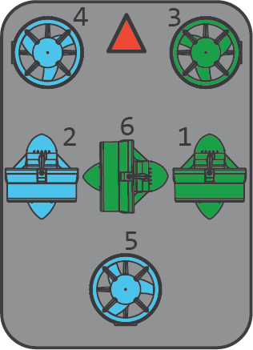
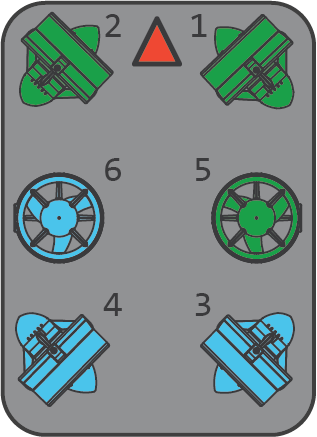
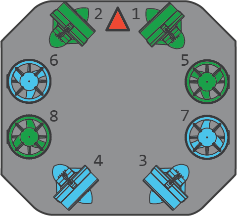
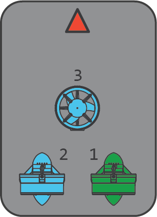
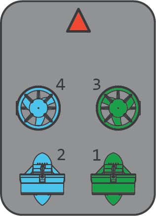
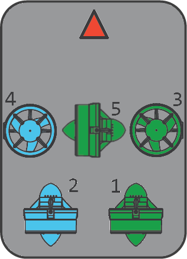

.. _sub-frames:

========================
Sub Frame Configurations
========================

Several bi-directional motor configurations/orientations are available in Sub:

Key to axis: R = Roll, P = Pitch, Y = Yaw, Z= Depth, F = Forward, L = Lateral

=============================   =======  ================  ==================
:ref:`FRAME_TYPE<FRAME_TYPE>`   #MOTORS  NAME              Controllable Axes
=============================   =======  ================  ==================
0                                  6     BlueROV1          R/P/Y/Z/F/L
1                                  6     Vectored          R/Y/Z/F/L
2                                  8     Vectored_6DOF     R/P/Y/Z/F/L
3                                  8     Vectored_6DOF-90  R/P/Y/Z/F/L
4                                  3     SimpleROV-3       Y/Z/F 
5                                  4     SimpleROV-4       R/Y/Z/F 
6                                  5     SimpleROV-5       R/Y/Z/F/L 
=============================   =======  ================  ==================

.. note:: Configurations lacking one or more controllable axes rely on proper CG and ballast to maintain earth-frame stability in that axis.

Frames
======

For reference, the following frame configuration diagrams show rough thruster locations and orientations from a top-down view.
Where possible thrusters acting along a shared axis should be set to counter-rotate, to minimise incidental torque generation
(e.g. green indicates clockwise propellers, and blue counter-clockwise (or vice-versa)).

+--------------------------------------------+----------------------------------------+-----------------------------------------------------+
| |BlueROV1|                                 | |Vectored|                             | |Vectored-6DoF|                                     |
|                                            |                                        |                                                     |
| | **BlueROV1 Configuration** with 6-DoF    | | **Vectored ROV** with side-by-side   | | **Vectored-6DoF ROV w/ Four Vertical Thrusters**, |
|   thruster positioning.                    |   vertical thrusters. Used for the     |   an 8-thruster configuration with 6-DoF control    |
| | (Frame ``bluerov``)                      |   `BlueROV2 <https://bluerov2.com>`__. |   and heavy lifting capacity. Used for the          |
|                                            | | (Frame: ``vectored``)                |   |BlueROV2-Heavy|.                                 |
|                                            |                                        | | (Frame: ``vectored6dof``)                         |
|                                            |                                        |                                                     |
+--------------------------------------------+----------------------------------------+-----------------------------------------------------+
| |SimpleROV-3|                              | |SimpleROV-4|                          | |SimpleROV-5|                                       |
|                                            |                                        |                                                     |
| | **ROV** with a single vertical thruster. | | **ROV** with side-by-side vertical   | | **ROV** with a lateral thruster and side-by-side  |
| | (Frame: ``simplerov3``)                  |   thrusters.                           |   vertical thrusters.                               |
|                                            | | (Frame: ``simplerov4``)              | | (Frame ``simplerov5``)                            |
|                                            |                                        |                                                     |
+--------------------------------------------+----------------------------------------+-----------------------------------------------------+

.. |BlueROV2-Heavy| replace:: `BlueROV2 Heavy <https://bluerobotics.com/introducing-bluerov2-heavy/>`__

Changing Thruster Motor Direction
=================================

Several methods are available:

- If brushless, two of the three motor wires can be swapped
- If BLHeli or AM32 ESC is being used, the motor direction can be reversed using the ESC configurator tool, either by direct connection or using ArduPilot's :ref:`PassThrough Support <common-blheli32-passthru>`
- The ``MOTx_DIRECTION`` parameters can be changed.
- The MOTORDETECT mode can be used while at rest underwater to automatically detect and correct the motor direction for bi-directional thrusters. However, this only affects those thrusters which control Roll, Pitch, and/or Yaw axes.
