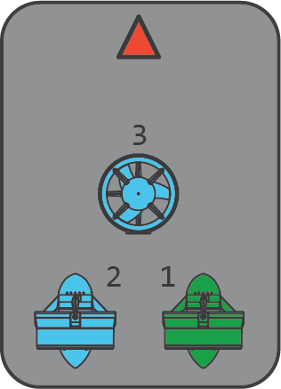

.. _sub-frames:

========================
Sub Frame Configurations
========================

Several bi-directional motor configurations/orientations are available in Sub:

Key to axis: R = Roll, P = Pitch, Y = Yaw, Z= Depth, F = Forward, L = Lateral

=============================   =======  ================  ==================
:ref:`FRAME_TYPE<FRAME_TYPE>`   #MOTORS  NAME              Controllable Axes
=============================   =======  ================  ==================
0                                  6     BlueROV1          R/P/Y/Z/F/L
1                                  6     Vectored          R/Y/Z/F/L
2                                  8     Vectored_6DOF     R/P/Y/Z/F/L
3                                  8     Vectored_6DOF-90  R/P/Y/Z/F/L
4                                  3     SimpleROV-3       Y/Z/F 
5                                  4     SimpleROV-4       R/Y/Z/F 
6                                  5     SimpleROV-5       R/Y/Z/F/L 
=============================   =======  ================  ==================

.. note:: configurations lacking one or more controllable axes rely on proper CG and ballast to maintain earth-frame stability in that axis.

Frames
======

Green indicates clockwise propeller rotation, Blue, counter-clockwise

BlueROV1
--------
.. image:: ../images/bluerov-frame.png
    :target: ../_images/bluerov-frame.png

Vectored
--------
.. image:: ../images/vectored-frame.png
    :target: ../_images/vectored-frame.png

Vectored-6DOF
-------------
.. image:: ../images/vectored6dof-frame.png
    :target: ../_images/vectored6dof-frame.png

SimpleROV-3
-----------

SimpleROV-4
-----------
.. image:: ../images/simple4-frame.png
    :target: ../_images/simple4-frame.png

SimpleROV-5
-----------

Changing Thruster Motor Direction
=================================

Several methods are available:

- If brushless, two of the three motor wires can be swapped
- If BLHeli or AM32 ESC is being used, the motor direction can be reversed using the ESC configurator tool, either by direct connection or using ArduPilot's :ref:`PassThrough Support <common-blheli32-passthru>`
- The ``MOTx_DIRECTION`` parameters can be changed.
- The MOTORDETECT mode can be used while at rest underwater to automatically detect and correct the motor direction for bi-directional thrusters. However, this only affects those thrusters which control Roll, Pitch, and/or Yaw axes.
