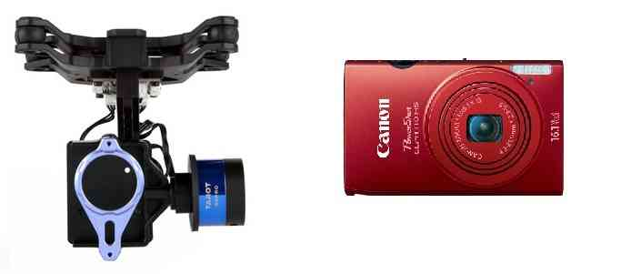

.. _common-cameras-and-gimbals:

===================
Cameras and Gimbals
===================

Copter, Plane and Rover support up to 3-axis gimbals, including advance
features like automated aiming of the camera at a Region of Interest
(ROI), and automatic triggering of a camera shutter.  This article
explains how to configure gimbals and shutter triggering based on your
hardware setup.

Gimbals and gimbal controllers
==============================

UAVs use gimbals to provide an independently controlled and stable
platform for photography. ArduPilot supports both brushless direct drive
gimbals (Tarot, SToRM32) that have a separate controller (providing
self-stabilisation), and the increasingly-less-common servo-driven
gimbals where both control and gimbal stabilisation are provided by
ArduPilot.

-  :ref:`Tarot Gimbal <common-tarot-gimbal>` — a popular 2-axis gimbal
   controller and gimbal kit that is controlled using PWM signals.
-  :ref:`SToRM32 Gimbal Controller <common-storm32-gimbal>` — an
   inexpensive 3-axis *brushless gimbal controller* that can be used
   with a number of gimbals (available separately). It is controlled
   with MAVLink commands over a serial interface; a richer format than
   PWM.
-  :ref:`Camera Gimbal with Servos <common-camera-gimbal>` — older-style
   servo-driven gimbal where ArduPilot provides both positioning and
   stabilisation.

.. _common-cameras-and-gimbals_camera_shutter_triggering:

Camera shutter triggering
=========================

ArduPilot allows you to :ref:`configure the camera shutter output port <common-camera-shutter-with-servo>` (servo, relay). In :ref:`camera mission planning <common-camera-control-and-auto-missions-in-mission-planner>`
you can specify when the camera shutter should trigger, or a distance
that the vehicle should travel between shots.

Camera manufacturers use their own mechanisms for remote control of the
camera (including its shutter). The topics explain how to configure the
camera shutter, and list a number of different approaches for converting
the output signal into the form expected by your particular camera:

-  :ref:`Camera Shutter Configuration in Mission Planner <common-camera-shutter-with-servo>`
-  :ref:`Camera Shutter Triggering using CHDK <common-apm-to-chdk-camera-link-tutorial>`
-  :ref:`CHDK Camera Control Tutorial <common-chdk-camera-control-tutorial>` (non-standard
   integration)
-  :ref:`3DR Camera Control Board <common-camera-control-board>` (prototype
   - many cameras)

Detail topics
=============

.. toctree::
    :maxdepth: 1

    Tarot Brushless Gimbal <common-tarot-gimbal>
    SToRM32 Gimbal Controller <common-storm32-gimbal>
    Gimbal with Servos <common-camera-gimbal>
    Camera Shutter Configuration <common-camera-shutter-with-servo>
    Camera Triggering using CHDK <common-apm-to-chdk-camera-link-tutorial>
    Camera Shutter Trigger Boards for Purchase <common-camera-shutter-triggering-cables-for-purchase>
    CHDK Camera Control <common-chdk-camera-control-tutorial>

