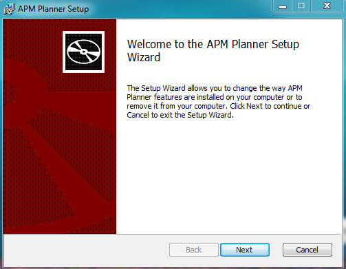
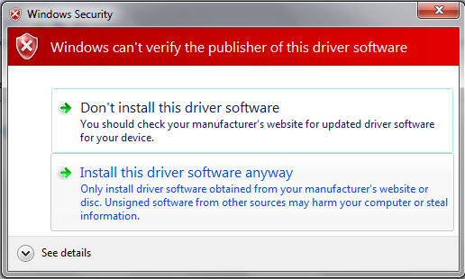

.. _common-install-mission-planner:

==========================
Installing Mission Planner
==========================

*Mission Planner* is free, open source software available for Windows.
These instructions will guide you through installing *Mission Planner*
on your ground station computer.

Download the most recent Mission Planner installer file
=======================================================

Download the `latest Mission Planner installer from here <http://firmware.ardupilot.org/Tools/MissionPlanner/MissionPlanner-latest.msi>`__.

Run the installation utility
============================

Open the Microsoft installer file (.msi) and select **Run** to run the
installation utility.

Follow the instructions to complete the setup process. The installation
utility will automatically install any necessary software drivers. If
you receive a DirectX installation error, please update your DirectX
plug-in from the `DirectX Download Center <http://www.microsoft.com/en-us/download/details.aspx?id=35>`__.

If you receive the warning pictured here, select **Install this driver
software anyway** to continue.

*Mission Planner* is normally installed in the **C:\\Program Files
(x86)\\APM Planner** folder or the \ **C:\\Program Files\\APM Planner**
folder. That is where your log files folder is located.

An icon to open the *Mission Planner* is created according to your
instructions during the installation.

Open Mission Planner
====================

Once installation is complete, open *Mission Planner* by clicking on its
system icon.

Then you can either:

-  :ref:`Connect Mission Planner to AutoPilot <common-connect-mission-planner-autopilot>` in order to
   receive telemetry and control the vehicle, or
-  :ref:`Load Firmware <common-loading-firmware-onto-pixhawk>`

Updating Mission Planner
========================

*Mission Planner* automatically notifies you about available updates
(when it is connected to the Internet).

Please always run the most current version of Mission Planner.

[copywiki destination="copter,plane,rover,planner"]

[site wiki="planner"]

.. toctree::
    :maxdepth: 1

    Mission Planner Advanced Installation <mission-planner-advanced-installation>
[/site]
