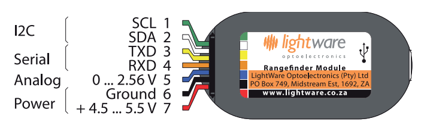
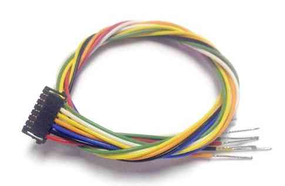
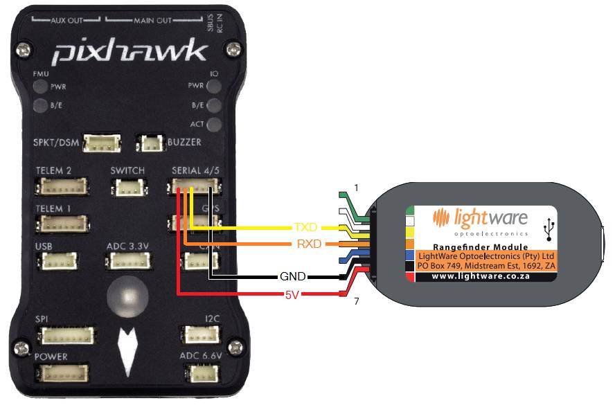
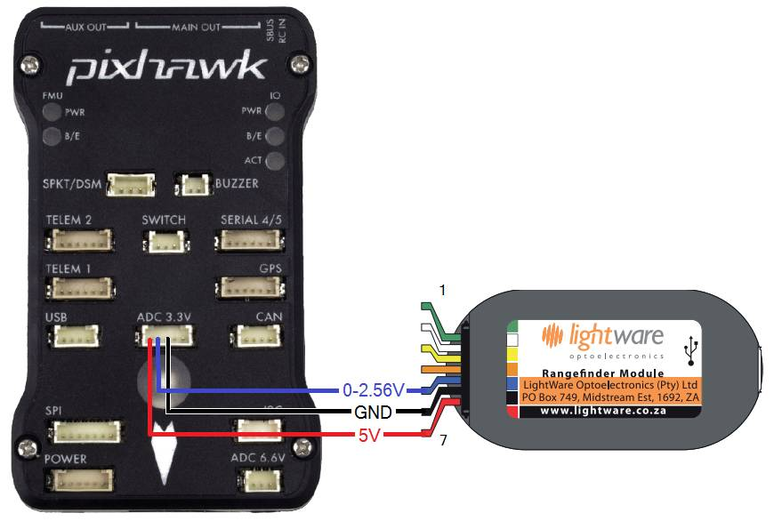
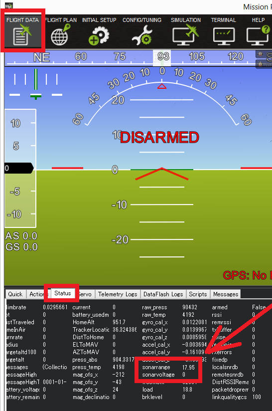

.. _common-lightware-sf10-lidar:

====================
LightWare SF10 Lidar
====================

The `Lightware SF10 <http://www.lightware.co.za/shop/en/>`__ series of laser
rangefinders are particularly lightweight, and provide fast and accurate
distance measurements. The series includes a number of models:
`SF10/A <http://www.lightware.co.za/shop/en/shop/en/rangefinders-and-altimeters/33-sf10a.html>`__
(25m),
`SF10/B <http://www.lightware.co.za/shop/en/shop/en/rangefinders-and-altimeters/32-sf10b.html>`__
(50m) and
`SF10/C <http://www.lightware.co.za/shop/en/shop/en/rangefinders-and-altimeters/34-sf10c.html>`__
(100m).

\ |SF10-B|

Connecting to the Pixhawk
=========================

The diagram below shows the SF10 output pins and a conveniently
colour-coded cable (which `you can purchase here <http://www.lightware.co.za/shop/en/shop/en/rangefinder-components/37-main-cable-type-1-35-cm.html>`__).
You can connect the SF10 series of laser rangerfinders using analog,
serial or I2C connections, as discussed in the following sections.

.. tip::

   The serial connection is recommended when using longer
   cables.

   SF10 Rangefinder: Output Pins

   Main cable for SF10 Rangefinder

Serial connection
-----------------

For a serial connection you can use any spare UART. Connect the RX line
of the UART to the TX line of the Lidar, and the TX line of the UART to
the RX line of the Lidar. Also connect the GND and 5V lines. You do not
need flow control pins.

The diagram below shows how to connect to SERIAL4.

   Pixhawk and SF10Rangefinder: Serial Connection (SERIAL4)

You then need to setup the serial port and rangefinder parameters. If
you have used the SERIAL4/5 port on the Pixhawk then you would set the
following parameters (this is done in the *Mission Planner*
**Config/Tuning \| Full Parameter List** page):

-  ``SERIAL4_PROTOCOL=9``
-  ``SERIAL4_BAUD=19200``
-  ``RNGFND_TYPE=8`` (LightWareSerial)
-  ``RNGFND_SCALING=1``
-  ``RNGFND_MIN_CM=5``
-  ``RNGFND_MAX_CM=5000``
-  ``RNGFND_GNDCLEAR=`` *Your offset to ground*

The ``RNGFND_MAX_CM`` is the distance in centimeters that rangefinder
can reliably read. The value of this setting depends on the model of
Lidar (50 meters is the nominal maximum range for the
`SF10/B <http://www.lightware.co.za/shop/en/shop/en/rangefinders-and-altimeters/32-sf10b.html>`__).

If you instead were using the Telem2 port on the Pixhawk then you would
use the ``SERIAL2_PROTOCOL`` and ``SERIAL2_BAUD`` parameters.

``RNGFND_GNDCLEAR`` is the distance in centimetres from the range finder
to the ground when the vehicle is landed (the parameter value will
depend on how you have mounted the rangefinder).

I2C connection
--------------

.. warning::

   I2C support for this rangefinder is not present in Copter 3.3
   or Rover 2.50 (planned for Copter 3.4). Support is present in Plane in
   the current stable release (Plane 3.4).

Connect the SDA line of the Lidar to the SDA line of the I2C port on the
Pixhawk, and the SCL line of the Lidar to the SCL line of the I2C port.
Also connect the GND and 5V lines.

.. figure:: ../../../images/Pixhawk_Rangefinder_SF10_I2C.jpg
   :target: ../_images/Pixhawk_Rangefinder_SF10_I2C.jpg

   Pixhawk and SF10 Rangefinder: I2CConnection

You then need to configure the rangefinder parameters as shown below
(this is done in the *Mission Planner* **Config/Tuning \| Full Parameter
List** page):

-  ``RNGFND_TYPE=7`` (LightWareI2C)
-  ``RNGFND_SCALING=1``
-  ``RNGFND_MIN_CM=5``
-  ``RNGFND_MAX_CM=5000``
-  ``RNGFND_GNDCLEAR=`` *Your offset to ground*
-  ``RNGFND_ADDR=85`` (I2C Address of lidar in decimal)

The ``RNGFND_MAX_CM`` is the distance in centimeters that rangefinder
can reliably read. The value of this setting depends on the model of
Lidar (50 meters is the nominal maximum range for the
`SF10/B <http://www.lightware.co.za/shop/en/shop/en/rangefinders-and-altimeters/32-sf10b.html>`__).

``RNGFND_GNDCLEAR`` is the distance in centimetres from the range finder
to the ground when the vehicle is landed (the parameter value will
depend on how you have mounted the rangefinder).

``RNGFND_ADDR`` is the I2C address as specified in the settings of the
lidar. Please note that this setting is in decimal and not hexadecimal
as shown in the lidar settings screen. The default address for LightWare
devices is 0x55 (Which is 85 in decimal).

Analog connection
-----------------

The SF10's Analog Out pin (5) should be connected to the Pixhawk's 3.3V
ADC (analog to digital converter).  The Pixhawk will provide the
regulated 5V power supply needed by the sensor using the 5V and GND pins
of the ADC connector.

   Pixhawk and SF10 Rangefinder:Analog Connection

You then need to setup the ADC and rangefinder parameters as shown below
(this is done in the *Mission Planner* **Config/Tuning \| Full Parameter
List** page):

-  ``RNGFND_TYPE = 1`` (Analog)
-  ``RNGFND_SCALING = 19.531``
-  ``RNGFND_MIN_CM = 5``
-  ``RNGFND_MAX_CM = 5000``
-  ``RNGFND_PIN = 14`` (2nd pin of 3.3V ADC connector)
-  ``RNGFND_GNDCLEAR =`` *Your offset to ground*

The ``RNGFND_MAX_CM`` is the distance in centimeters that rangefinder
can reliably read. The value of this setting depends on the model of
Lidar (50 meters is the nominal reliable range for the
`SF10/B <http://www.lightware.co.za/shop/en/shop/en/rangefinders-and-altimeters/32-sf10b.html>`__).

``RNGFND_GNDCLEAR`` is the distance in centimetres from the range finder
to the ground when the vehicle is landed (the parameter value will
depend on how you have mounted the rangefinder).

The ``RNGFND_SCALING`` value depends on the voltage on the rangefinders
output pin at the maximum range. By default the SF10/B will output 2.56V
at 50m, so the scaling factor is 50m / 2.56v ≈ 19.53 (the analog
distance range for each of the rangefinder variants can be found in the
`SF10 Manual <http://www.lightware.co.za/shop/en/shop/en/index.php?controller=attachment&id_attachment=9>`__).
The manual explains how you can confirm and change the maximum output
range/voltage.

.. tip::

   We highly recommend that you tune the ``RNGFND_SCALING`` value by
   comparing the output against a known distance.

Testing the sensor
==================

Distances read by the sensor can be seen in the Mission Planner's Flight
Data screen's Status tab. Look closely for "sonarrange".

.. |SF10-B| image:: ../../../images/SF10-B.jpg
    :target: ../_images/SF10-B.jpg