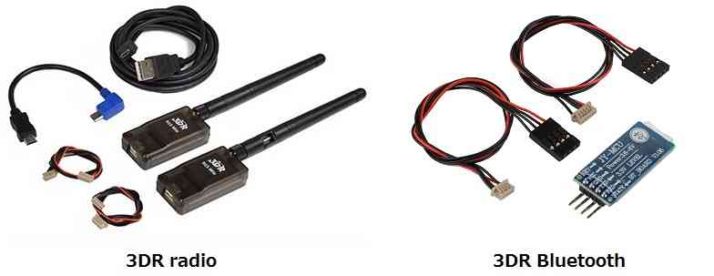

.. _common-telemetry-landingpage:

========================
Telemetry (landing page)
========================

Copter/Plane/Rover support sharing information with a ground station (or
transmitter) using telemetry. Follow the links below for configuration
information based upon your set-up.

.. toctree::
    :maxdepth: 1

    RFD900 <common-rfd900>
    SiK Radio v2 <common-sik-telemetry-radio>
    Telemetry Radio Regional Regulations <common-telemetry-radio-regional-regulations>
    Configuring a Telemetry Radio <common-configuring-a-telemetry-radio-using-mission-planner>
    Bluetooth <common-mission-planner-bluetooth-connectivity>
    FrSky telemetry <common-frsky-telemetry>
    XBee <common-telemetry-xbee>
    SiK Radio — Advanced Configuration <common-3dr-radio-advanced-configuration-and-technical-information>
    3DR Radio v1 <common-3dr-radio-v1>
