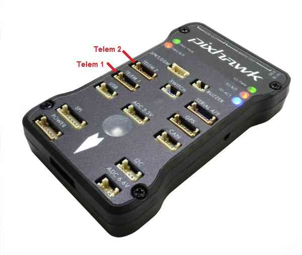
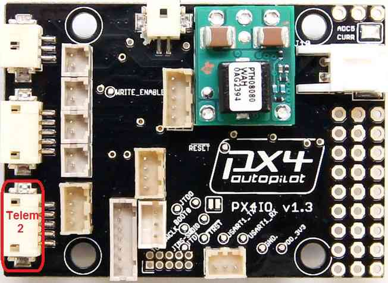
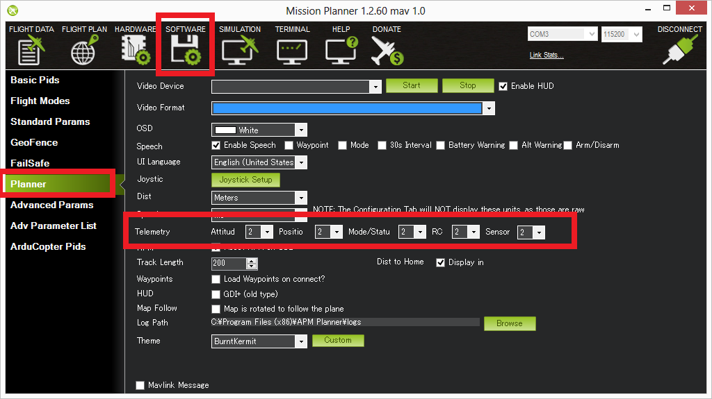

.. _common-telemetry-port-setup-for-apm-px4-and-pixhawk:

========================================
Telemetry Port Setup for Pixhawk and PX4
========================================

This article shows how to enable the second telemetry port on Pixhawk
and PX4 and configure the ports in Mission Planner.

.. note::

   Support for the second port was added in Copter 3.1 and equivalent
   Rover/Plane firmware.

Enable 2nd Telemetry Port on Pixhawk
====================================

On a Pixhawk there are two 6 pin DF13 serial ports marked as "telemetry"
(TELEM 1 and TELEM 2). Both ports will be active for communication.

Use **TELEM 1** for higher power devices (up to 1A), such as the :ref:`3DR RFD900 telemetry radio <common-rfd900>`.

Enable 2nd Telemetry Port on PX4
================================

On a PX4v1 you can enable the second telemetry port by creating a empty
file named **uartD.en** in the APM directory on your SD card. This
changes the 5 pin DF13 (FMU USART2) connector on the corner of the PX4IO
board from being 3 PWM outputs to being a second telemetry port.

Set-up through the Mission Planner
==================================

The telemetry port is configured using parameters, which you can edit
though your GCS. Using *Mission Planner* open the **Config/Tuning \|
Full Parameter List** page.

The parameters to change for each port are listed below. These are
documented with the parameter in Mission Planner and in the Parameter
documentation on each wiki:

-  Telem1: ``SERIAL1_BAUD``, ``SERIAL1_PROTOCOL``, ``BRD_SER1_RTSCTS``
-  Telem2: ``SERIAL2_BAUD``, ``SERIAL2_PROTOCOL``, ``BRD_SER2_RTSCTS``

.. image:: ../../../images/MP-Serial2_protocol.png
    :target: ../_images/MP-Serial2_protocol.png

You can also set the desired stream rates for messages on the ports (the
telemetry rates to zero to try to keep CPU loads down) by setting
``SR1_*`` and ``SR2_*`` parameters in the *Advanced Parameter List*. Due
to CPU resource limitations, the actual rate of the data sent and saved
may be lower than the rate requested.

The data can also be changed in the Mission Planner's **Software \|
Planner** screen's **Telemetry** drop-down.

.. warning::

   If you change the rates using the ``REQUEST_DATA_STREAM``
   MAVLink message Copter **DOES NOT** save the rate changes and they
   will not persist over a reboot.
