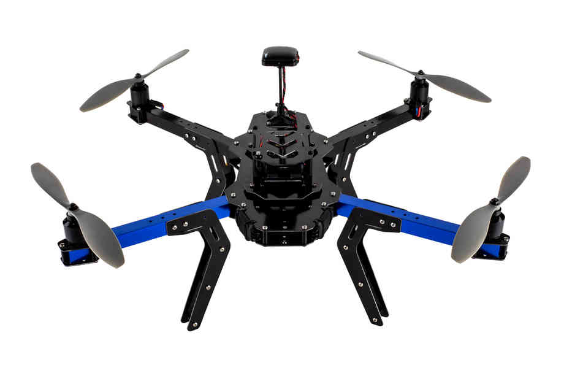
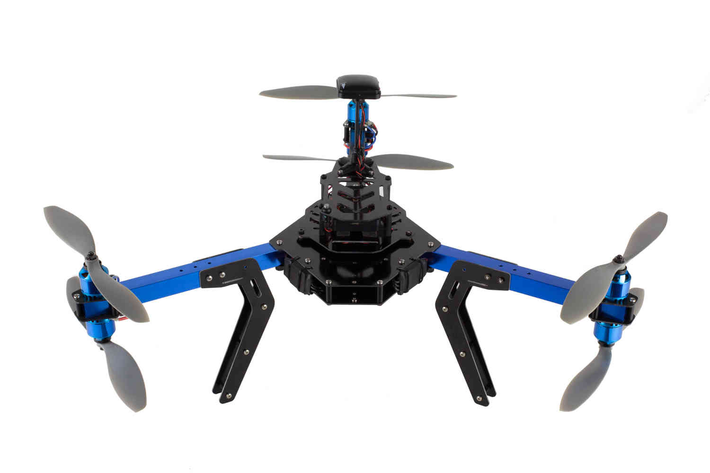

.. _3dr-kits-and-best-practices:

===========================
3DR 套件和最佳实践
===========================

3DR 套件
========

 `3DRobotics 商城 <https://store.3dr.com/t/diyparts>`__提供两种组装套件（四轴和Y6）。点击下面的图片跳转到组装说明页面。 

最佳实践
==============

..  youtube:: 33Tl_rjhQEE
    :width: 100%

当你组装你的直升机的时候，我们建议你在所有电机上使用自锁螺丝。关于使用自锁螺丝，请观看
 `本视频 <https://www.youtube.com/watch?v=qaO3wL3Ypqg>`__. 固定电线的时候，尽量使用扎带把同组线扎在一起，在必要的地方使用电缆网固定。 至少使用一种 :ref:`减震和隔离 <common-vibration-damping>` 中描述的减震策略。
