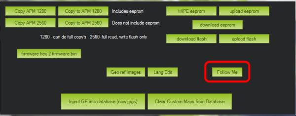

.. _ac2_followme:

============================
跟随模式 (GSC 开启)
============================

使用遥感无线电和地面站，跟随模式可以让你的直升机跟着你移动成为可能

.. note::

   不像 "特有的"自动驾驶模式，这个功能的实现在于地面站。地面站使用微型飞行器链接遥测技术读取载具位置来控制其移动，发送引导模式指令来适当的移动载具。目前这项功能由Windows笔记本电脑的*任务规划* 、OS X笔记本电脑的APM规划和Android设备的机器人规划来支持。

你需要什么
================

#. 带有遥测技术的直升机
#. 一台笔记本电脑
#. 一个GPS USB适配器 `像这种 <http://www.amazon.com/ND-100S-GlobalSat-USB-GPS-Receiver/dp/B004K39QTY/refsr_1_9?ieUTF8&qid1329773762&sr=8-9>`__
   或者一个蓝牙GPS组件 `像这种 <http://www.amazon.com/GlobalSat-BT-368i-Bluetooth-GPS-Receiver/dp/B0018YZ836/refsr_1_2?selectronics&ieUTF8&qid1329773963&sr1-2>`__.

任务规划指令
================================

#. 飞行模式设置成 "悬停"
#. 找一块空地设置你的直升机，通过无线遥测建立微型飞行器连接
#. 确保GPS USB适配器或者蓝牙组件已插入笔记本电脑并显示串行端口。使用组件自带的软件，确保它能正常工作并已经GPS锁定。
#. 起飞，一旦飞到空中，切换到悬停。 (要有足够的高度以确保直升机在跟随你的时候不攻击你，这是个不错的主意).
#. 在任务规划飞行数据屏上，试着右键点击附件的点选择 "飞到这里". 如果它能正常工作，你可以准备尝试跟随模式。
#. 在Mission Planner中输入 Control-F，会出现以下对话框， 点击 "Follow Me"

-  接着会出现这个对话框，选择分配给你GPS设备的串行口，不管它所使用的波特率是多少。

.. image:: ../images/followme2.png
    :target: ../_images/followme2.png

-  一旦点击 "Connect",  Mission Planner将通过你的设备读取GPS数据，每隔2移就会给直升机发送"飞到这里" 的指令。

-  现在拿起你的笔记本电脑，开始四处走走。
-  直升机应该会跟随着你！

   -  如果你把高度设置到5英尺，这是个不错的主意，看看你能否运行它。
   -  如前所言，足够的高度对避免受伤是有用的。
   -  这是一个很棒的功能，在使用跟随模式特别是旋翼打开的多通道直升机的时候，一定要注意安全。 

-  **警告:** 像自动驾驶其它模式对高度保持负责一样（悬停，高度保持），气压计用于高度计算，就是说随着时间的流逝，直升机会根据气压发生位移而不是实际距地面的高度。
