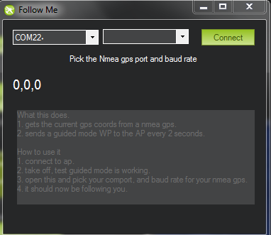

.. _ac2_followme:

============================
跟随模式 (GSC 开启)
============================

使用遥感无线电和地面站，跟随模式可以让你的直升机跟着你移动成为可能

.. note::

   不像 "特有的"自动驾驶模式，这个功能的实现在于地面站。地面站使用微型飞行器链接遥测技术读取载具位置来控制其移动，发送引导模式指令来适当的移动载具。目前这项功能由Windows笔记本电脑的*任务规划* 、OS X笔记本电脑的APM规划和Android设备的机器人规划来支持。

你需要什么
================

#. 带有遥测技术的直升机
#. 一台笔记本电脑
#. 一个GPS USB适配器 `像这种 <http://www.amazon.com/ND-100S-GlobalSat-USB-GPS-Receiver/dp/B004K39QTY/refsr_1_9?ieUTF8&qid1329773762&sr=8-9>`__
   或者一个蓝牙GPS组件 `像这种 <http://www.amazon.com/GlobalSat-BT-368i-Bluetooth-GPS-Receiver/dp/B0018YZ836/refsr_1_2?selectronics&ieUTF8&qid1329773963&sr1-2>`__.

任务规划指令
================================

#. 飞行模式设置成 "悬停"
#. 找一块空地设置你的直升机，通过无线遥测建立微型飞行器连接
#. 确保GPS USB适配器或者蓝牙组件已插入笔记本电脑并显示串行端口。使用组件自带的软件，确保它能正常工作并已经GPS锁定。
#. 起飞，一旦飞到空中，切换到悬停。 (要有足够的高度以确保直升机在跟随你的时候不攻击你，这是个不错的主意).
#. 在任务规划飞行数据屏上，试着右键点击附件的点选择 "飞到这里". 如果它能正常工作，你可以准备尝试跟随模式。
#. In the Mission Planner, enter Control-F, which will open the
   following window. Click on "Follow Me"

-  This will bring up this window. Select the serial port that is
   assigned to your GPS device and whatever baud rate it uses.

-  Once you click "Connect", the Mission Planner will read the GPS data
   from your device and send it to your Copter as "fly to here" commands
   every two seconds.

-  Now pick up your laptop and start walking around.
-  The Copter should follow you!

   -  If you have set the altitude to 5 feet it might be a good idea to
      see if you can out run it.
   -  As mentioned before, sufficient altitude to prevent injury is
      useful.
   -  Seriously this is a great capability, but safety is really
      important when using Follow Me mode especially with an open bladed
      Multicopter.

-  **Warning:** Like all other modes in which the autopilot is
   responsible for altitude hold (Loiter, AltHold), the barometer is
   used in the altitude calculation meaning that it can drift over time
   and the copter will follow the air pressure change rather than actual
   altitude above ground.
