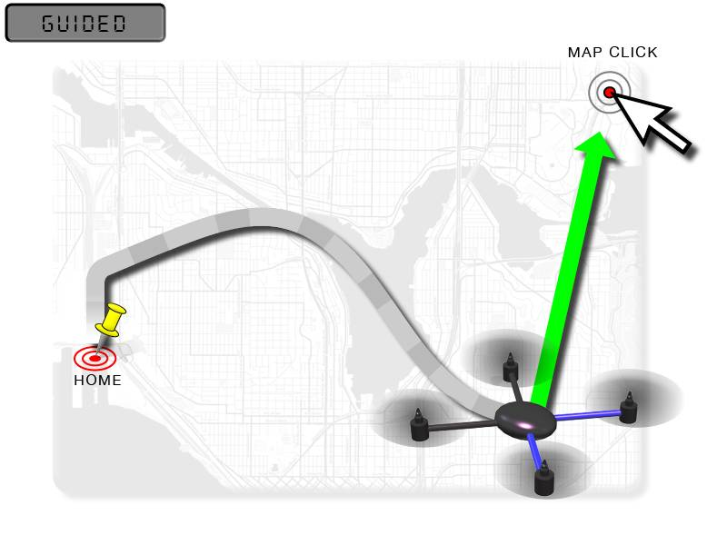
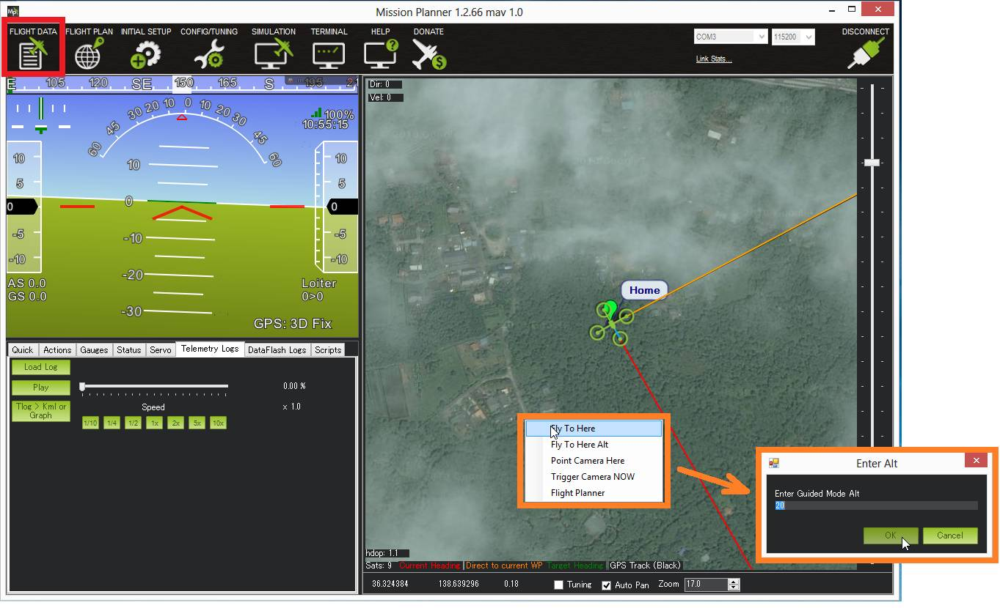
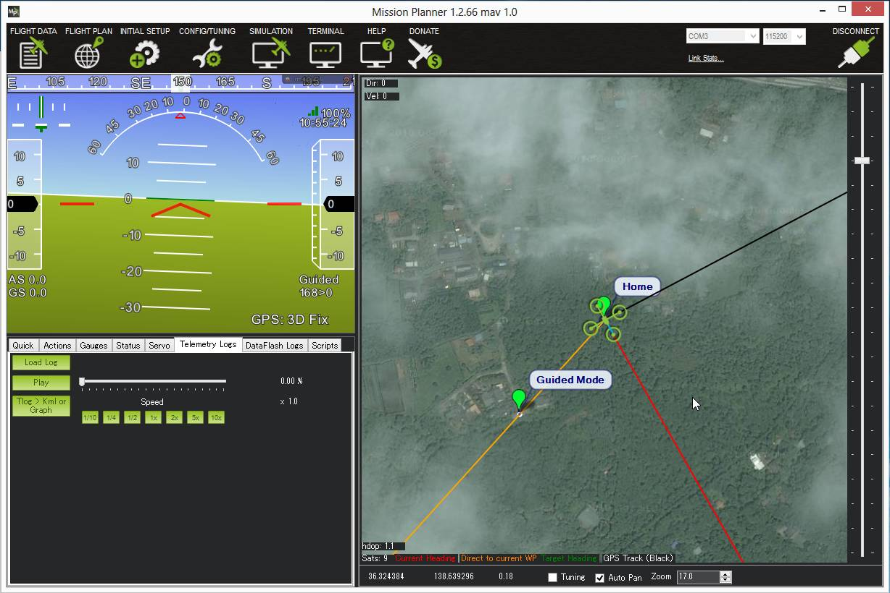

.. _ac2_guidedmode:

===========
导航模式
===========

导航模式是指无人机的一种功能，它使用遥感无线模块和地面站应用程序，无线动态引导无人机到目标位置。本页面提供使用导航模式的指令。

概述
========

导航模式并不是传统的飞行模式，它和其它飞行模式一样需要分配模式开关。 使用地面站应用程序（如任务规划）和遥感无线电(如 :ref:`SiK Telemetry Radio <common-sik-telemetry-radio>`)可启用导航模式功能. 
此功能允许使用交互命令无人机去指定位置，只要点击任务计划飞行数据地图上的一点。 无人机一旦到达指定位置，将在那个位置处于盘旋状态，等待下一个目标指令。跟随模式也使用导航模式使无人机跟随驾驶员。

你需要什么
================

要使用导航模式，你需要一个页面 :ref:`遥感无线电 <常规遥感登陆页面>` 
+在飞行时允许电脑和无人机交流allowing your computer and
+autopilot to communicate during flight, 一台地面站电脑或平板，一个地面站应用程序，如 :ref:`Mission Planner <planner:home>`.

说明
============

-  找一块空地设置你的无人机，在无人机和笔记本电脑之间通过无线遥感建立MAVLink连接
-  在笔记本电脑上，使用遥感组件自带的软件，确定它是工作的，并有GPS锁定。
-  在稳定模式下起飞 :ref:`稳定模式 <stabilize-mode>` 一旦升到合理的高度，切换到悬停.
-  在任务规划飞行数据屏地图上，尝试右键点击一个附近的点，然后选择 "飞到这里"。
-  会出现一个导航模式高度对话框，输入一个家的高度单位是米。

-  导航目标会出现在地图上，橙线（表示目标前进方向）会指出导航目标。

-  无人机到达目标位置后会等在那儿，直到你输入另外的位置或者切换到其它模式。

.. note::

   在任务规划状态下飞行模式无需设置成“导航”。 对其它地面控制台而言这样可能不行。
