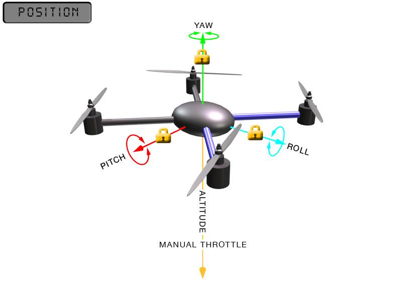

.. _ac2_positionmode:

=============
位置模式
=============

**位置模式** 和悬停模式一样，但是带有手动油门控制装置。 这就是说在位置模式下，直升机保持一致的位置和航向，同时允许操作员手动控制油门。

.. warning::

 此模式不适用于AC3.2和更高版本。

位置模式依赖于GPS，所以在使用这种模式时预位直升机之前要确保GPS已锁定，这点非常重要。GPS锁定由以下LED状态指示 ：

-  APM上的蓝光LED是常亮的。
-  GPS组件上的蓝光LED是常亮的。
-  GPS+Compass组件上的蓝光LED是闪烁的。
