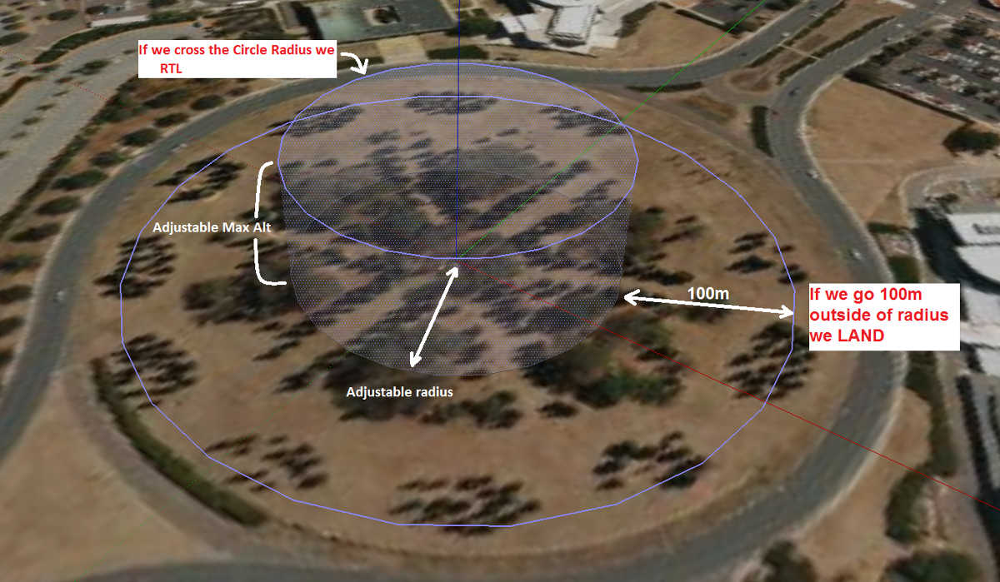
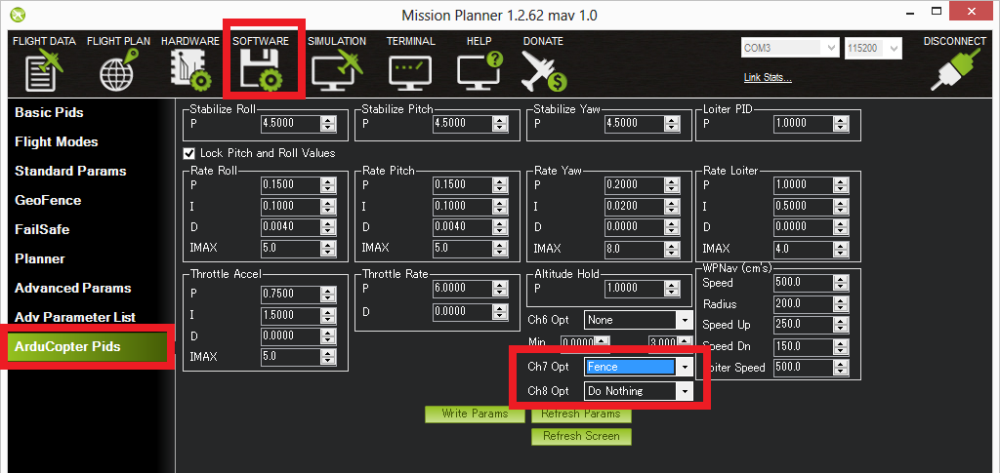

.. _ac2_simple_geofence:

===============
简单电子栅栏
===============

 概述
========

AC 3.0.1 (和更高版本)以起点为中心有一个简单的 "锡罐" 形状栅栏，通过启动RTL来试图阻止直升机飞太远。使用Mission Planner可设置圆形距离和高度的最大值以及当接近栅栏边缘时载具的行为。

如果载具飞出这些边缘它将切换到RTL或者LAND。此时栅栏被冲破，会建立一个向外（或向上）延伸20M的备用栅栏。如果直升机突破这个备用栅栏（例如：如果载具没有正确设置或操作者采取控制却不能恢复直升机朝起始点飞行）直升机将被重新切换到RTL（将会建立另一个向外多增加20M的备用栅栏）

如果直升机最后飞出配置栅栏100M以外，载具将会切换到LADN模式。他们认为让直升机回到起始点显然是不可能的，最好的办法是让它降落。驾驶员用飞行模式开关可以重新控制飞行路线。像前面的栅栏，再建立一个向外20M的栅栏，如果它突破这个栅栏继续远离起始点，直升机将更次切换到LAND模式。

使用Mission Planner激活栅栏
=====================================

.. image:: ../images/Fence_MPSetup.png
    :target: ../_images/Fence_MPSetup.png

采取以下步骤可启用栅栏：

-  连接 APM/PX4 至Mission Planner
-  进到入 **Software \| GeoFence** 界面
-  点击 **Enable** 按钮
-  在 "Type"下选 "Altitude and Circle" (除非你只需一个高度限制或者一个圆形栅栏，这种情况下选择 
   "Altitude" 或 "Circle")
-  在Action下选 "RTL or Land"
-  在 "Max Alt" 下设置你的高度界限(单位米)
-  在 "Max Radius"下设置离起始点的最远距离(单位米)。一般至少50M 

使用通道7或8可启用栅栏
======================================

没必要安装一个开关启用或禁用栅栏，但如果你想使用开关来控制栅栏，请根据以下步骤安装：

-  打开Mission Planner软件 > 进入Copter Pids界面，然后把"Ch7 Opt"或"Ch8 Opt"设置成Fence。
-  保持交换器高（如PWM > 1800）启用栅栏，低（1800以下）禁用栅栏。

警告:
=========

-  栅栏半径最小值推荐为30M。
-  栅栏需要GPS运行良好，当启用栅栏时不要禁用:ref:`GPS arming check <prearm_safety_check>` 和 :ref:`EKF failsafe <ekf-inav-failsafe>`。 
   反之，如果你禁用其中一个，就会禁用栅栏。
-  为了达到最佳效果，请确保载具上的RTL正常工作。
-  随着栅栏启用，预解锁检查要求在解锁载具之前GPS锁定。
-  如果在启用栅栏时GPS故障保护没有启用，在飞行时GPS锁定松动，栅栏将会禁用。
-  如果在启用栅栏时GPS故障保护已启用，在飞行时GPS锁定松动，因为我们不再知道载具的位置，要确保直升机不会飞离栅栏太远，载具会切换到LAND模式。不管飞行模式是哪咱这种运行情况都会出现。如果不期望LAND模式的续发事件，飞行员可以通过活动飞行开关来重新控制。
-  备用栅栏是基于前一个被突破的栅栏向外20M而建立的，而不是从载具位置向外20M建立。这意味着如果你选择越过栅栏，在栅栏重新切换直升机到RTL(或LAND)前，恢复载具控制距离少于20M。如果真的要越过栅栏，你应该准备好切换飞行模式两次或者选择建立启用/禁用栅栏开关。

栅栏设置和操作视频概述
===============================================

..  youtube:: HDnGdo54o-4
    :width: 100%
