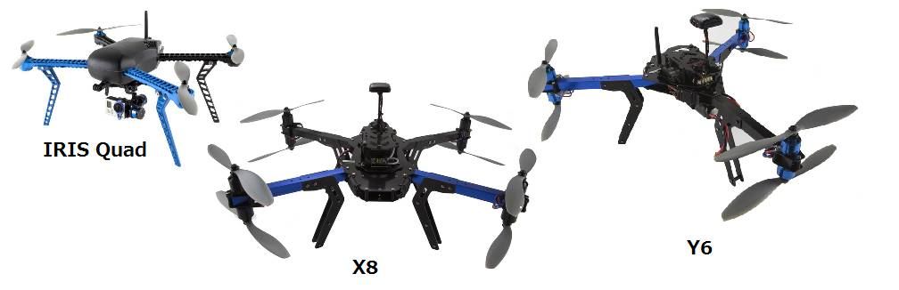

.. _choosing-a-frame:

============================
选择多旋翼直升机机架
============================

使用直升机的第一步就是决定使用哪个机架。下面是来自
`3DRobotics <http://store.3drobotics.com/>`__ 的三个可选项。
还有数以百计的其它选择。本页希望在可用的选择上给出一些指导。 

.. note::

   本手册的这段内容正在编写中。

决定你要用它来做什么
===========================

一些通用的多旋翼直升机包括:

-  拍摄 :ref:`航拍视频 <common-cameras-and-gimbals>`
-  :ref:`FPV (第一人称视角) <common-fpv-first-person-view>`
-  体育或者社交 (比赛，特技飞行，拍摄你的朋友)
-  更多专业的应用，比如： :ref:`三维地图 <common-3d-mapping>`，
   包裹投递，农业等。
-  用于研究或者作为个人机器人 :ref:`开发 <dev:home>`

到手即飞（RTF），套件还是自己做
====================================

选择到手即飞还是自己还是自己做关键看你乐意在搭建你的直升机上花费多少时
间，还有你想你的直升机多么的定制化。市场上越来越多的低价的到手即飞直升
机，比起自己做有那么一点点成本优势，尤其是小型直升机以及在搭建中你自己
的因素导致一些失误（比如买了错误的零件等）。

`像这些来自于3DR的完整的套件 <https://store.3dr.com/t/diyparts>`__ 是
可选的中间项。它们可以保证你获得你所需要的所有组件，最终结果会非常接近
于到手即飞的直升机，但它们要略微便宜一些。因为硬件的组装和飞行控制的配
置都是由你自己完成的。  

继续阅读
=================

下面是一些正在编辑中的页面，其中的信息对你选择或者自己搭建机架都是有帮
助的。

-  :ref:`3DR套件和最佳实践 <3dr-kits-and-best-practices>`
-  :ref:`搭建你自己的多旋翼直升机 <build-your-own-multicopter>`
-  :ref:`增强你的直升机功能 <improving-the-capabilities-of-your-multicopter>`
-  :ref:`先进的多旋翼直升机设计 <advanced-multicopter-design>`
