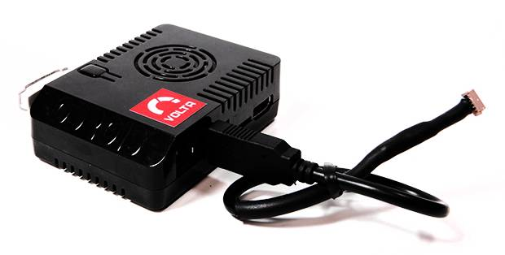

.. _common-companion-computers:

===================
Companion Computers
===================

This article lists turnkey "all in one" Companion Computer solutions.

   Volta 4Gmetry III CompanionComputer

Overview
========

Companion Computers travel on the vehicle and communicate with (and
control) the flight controller. The companion computer gets all the
MAVLink data produced by the autopilot (including GPS data) and can use
it to make intelligent decisions during flight. This enables a broad
range of functionality, from computer mediated flight paths, though to
very CPU intensive functionality such as vision processing.

.. note::

   The term "Companion Computer" is typically taken to mean an
   on-board Linux-based computer, running
   `DroneKit-Python <http://python.dronekit.io/>`__ or ROS, and
   communicating with the autopilot over a fast link using MAVLink
   messages.

   Using a companion computer is an alternative to using a fully integrated
   Linux autopilot.

This page is for plug and play solutions that require little
configuration or setup (see :ref:`Companion Computers <dev:companion-computers>` (dev
wiki) for developer-focused options).

List
====

Volta 4Gmetry III
-----------------

The `Volta 4Gmetry III <http://4gmetry.voltarobots.com/shop/4gmetry-iii/>`__ brings a huge
amount of power to Pixhawk-based drones. It's designed to compete with
the DJI Manifold at a lower price, and it's open source. OpenCV-based
computer vision, streaming HD video, 4G wireless and a 30-second
installation with Pixhawk.

For more information see:

-  `Purchase page <http://4gmetry.voltarobots.com/shop/4gmetry-iii/>`__
-  `New Volta companion computer for Pixhawk brings computer vision, more <http://diydrones.com/profiles/blogs/new-volta-companion-computer-for-pixhawk-brings-computer-vision-m>`__
   (DIY Drones Blog article.
