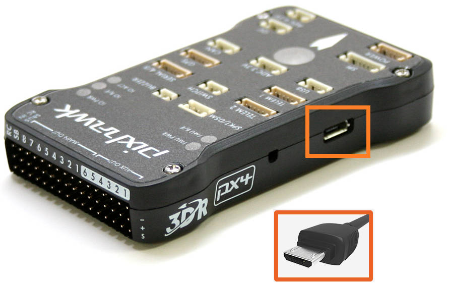
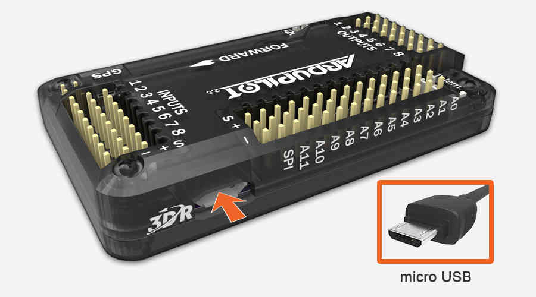
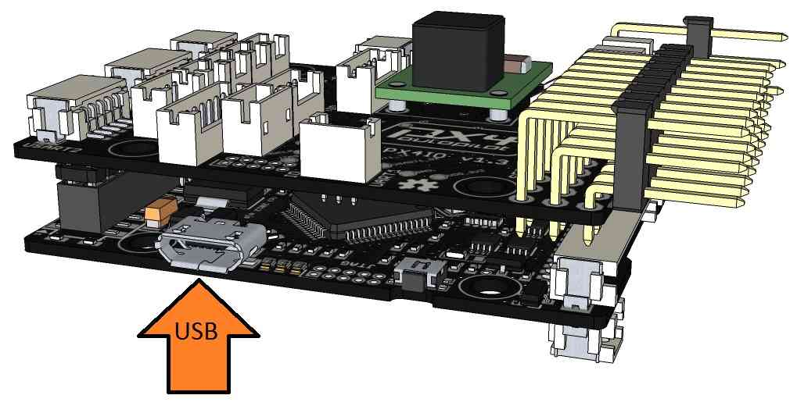
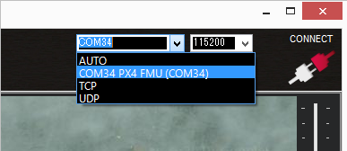
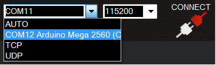
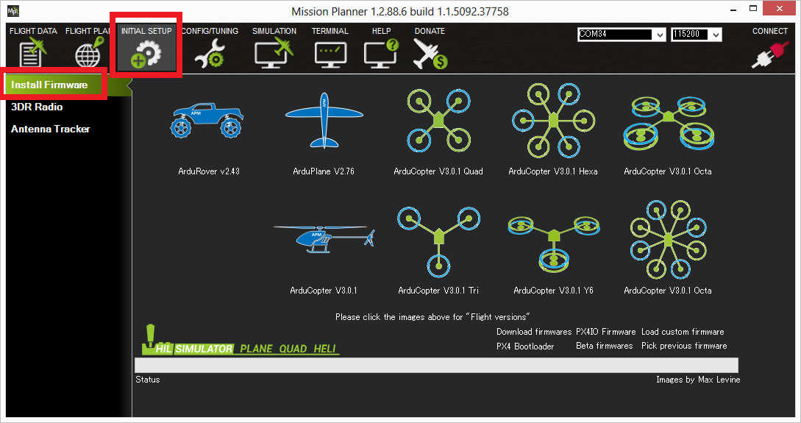

.. _common-loading-firmware-onto-pixhawk:

========================================
Loading Firmware onto Pixhawk/APM2.x/PX4
========================================

These instructions will show you how to download the latest firmware
onto the Pixhawk, APM 2.x or PX4 controller.

Connect controller to computer
==============================

Once you've :ref:`installed the Mission Planner <common-install-mission-planner>` onto your computer, connect
the autopilot board to your computer using the micro USB cable as shown
below. Use a direct USB port on your computer (not a USB hub).

   Pixhawk USB Connection

   APM USB Connection

   PX4 USB Connection

Windows should automatically detect and install the correct driver
software.

Connect to Mission Planner
==========================

Open the *Mission Planner* and select the COM port drop-down on the
upper-right corner of the screen (near the **Connect** button).  Select
**AUTO** or the specific port for your board (**PX4 FMU** or **Arduino
Mega 2560**). Set the Baud rate to **115200** as shown. Don't hit
**Connect** just yet.

Install firmware
================

On the Mission Planner's **Initial Setup \| Install Firmware** screen
select the appropriate icon that matches your frame (i.e. Quad, Hexa). 
Answer **Yes** when it asks you "Are you sure?".

   Mission Planner: Install FirmwareScreen

After the Mission Planner detects which board you are using (i.e.
Pixhawk) it will ask you to unplug the board, plug it back in and then
press **OK** within a few seconds (during this brief period the
bootloader accepts requests to upload new firmware).

.. figure:: ../../../images/Pixhawk_InstallFirmware2.png
   :target: ../_images/Pixhawk_InstallFirmware2.png

   Mission Planner: Install FirmwarePrompt

If all goes well you will see some status appear on the bottom right
including the words, "erase...", "program...", "verify.." and "Upload
Done".  The firmware has been succesfully uploaded to the board.

Testing
=======

You can test the firmware is basically working by switching to the
*Mission Planner Flight Data* screen and pressing the **Connect**
button.  The HUD should update as you tilt the board.

:ref:`Connect Mission Planner to AutoPilot <common-connect-mission-planner-autopilot>` has more
information on connecting to Mission Planner.
