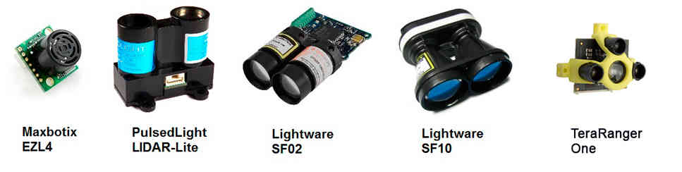

.. _common-rangefinder-landingpage:

===========================
Rangefinders (landing page)
===========================

Copter/Plane/Rover support a number of different rangefinders including
Maxbotix Sonar and Pulsed Light LED range finders.

.. note::

   Lidar's are used in flight modes which have height control, such
   as Altitude Hold, Loiter and PosHold Mode.  The data from the sensor
   will be used until you exceed RNGFND_MAX_CM, after that it switches to
   the barometer.  Currently Lidar is not supported in Auto
   Mode.

Follow the links below (or in sidebar) for configuration information
based upon your set-up.

.. toctree::
    :maxdepth: 1
    

    LIDAR-Lite <common-rangefinder-lidarlite>
    Maxbotic I2C Sonar <common-rangefinder-maxbotixi2c>
    Maxbotic Analog Sonar <common-rangefinder-maxbotix-analog>
    Lightware SF02 <common-rangefinder-sf02>
    LightWare SF10 Lidar <common-lightware-sf10-lidar>
    TeraRanger One Rangefinder <common-teraranger-one-rangefinder>

    

    Analog Sonar (AC3.1) <sonar>

