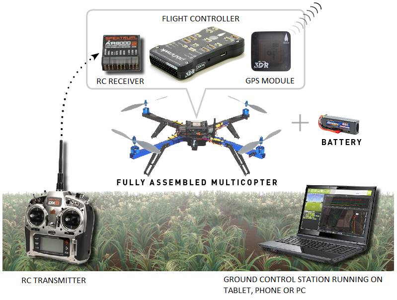

.. _introduction:

==================
直升机简介
==================

本手册所指的直升机是适用于多轴直升机、传统直升机以及其他机动车辆的高级开源自动驾驶系统。

概览
========

该直升机系统是针对多轮驱动交通工具的完全开源的自动驾驶解决方案，它(通过一系列智能飞行模式)提供了增强型遥控飞行，可以完全自主地执行任务。

作为 `DroneCode 软件平台 <https://www.dronecode.org/dronecode-software-platform>`__ 的一部分，它可以通过与地面控制站的无缝合作，监视和执行强大的任务规划活动。它还可以从DroneCode平台的拥有的其他部分得到好处，包括模拟器，日志分析工具和交通工具管理控制的高级接口等。

该直升机系统处于空中机器人的前沿，针对希望尝试先进技术的人群，引领前沿技术和新的飞行风格。它已经成为现售众多飞行交通工具的首选平台，并且可以轻松添加到你的定制飞行器中，来增强其功能。

主要特征
============

主要特征包括

-  *高质量的自动水平、自动高度控制*: 水平和垂直飞行，或者使用超级棒的“简单飞行”模式，该直升机系统是最易飞的多轴直升机之一。

   不需要眼睛一直关注着你的多轴直升机方向-不管多轴直升机向着哪个方向，只需往你想要飞行的方向推动摇杆，自动驾驶仪就会通过板载罗盘计算出你的意图。哪边是前，哪边是后，管它呢！
-  *自动起飞自动降落*: 拨动开关，看着直升机完全自主地执行完其使命，回到出发地点并自动降落，无需人工干涉。
-  *"悬停" 模式*: 直升机通过其高度传感器和GPS模块，保持在同一位置。
-  *返回出发点*: 拨动遥控器开关就可以使直升机自动飞回到出发点。
-  *故障安全:* 当直升机你控制器失去联系（或者超出了预先定义的地理围栏范围）时会自动识别状态，返回到出发点。如果检测到硬件故障，它还会尝试安全降落。
-  *无需编程*: 使用桌面版的 *Mission Planner* 软件就可以加载自动驾驶设备（一键操作），并可以对其进行设置。Mission Planner（或者其它兼容的地面站）有可以鼠标操作的任务规划界面，可以通过可视化的方式显示直升机的状态、设置和传感器数据。
-  *执行数百个GPS航点的任务*: 通过在Mission Planner中点击创建航点，直升机就可以自动飞过它们。你可以自动化包括摄像头控制的整个飞行任务！唯一的距离限制就是你直升机的电池续航能力。
-  *飞行中进行任务规划*: 使用无线双向连接器，设置航点、改变飞行模式、调节所有控制参数的增益，都可以通过你的笔记本或者移动设备实施完成-即便你的直升机还在飞行中！

入门
===============

如果你在一个成品的直升机上使用该系统，已经准备安装、配置和调试，准备试飞。我们建议你*仔细阅读你的飞机厂商提供的说明书*，尤其是关系到安全方面的信息。

一旦你熟悉了你的直升机的默认设置，你或许会想要配置你的遥控器或者直升机来尝试更多挑战性的  :ref:`飞行模式 <flight-modes>`, 或者 :ref:`选择一个地面站 <common-choosing-a-ground-station>` 开始自动飞行任务。

.. tip::

   无论你使用的是成品的交通设备，还是自己组装的，这些自主的交通工具都是有潜在的危险的！始终遵循 :ref:`最佳安全实践 <safety-multicopter>` 并密切关注一切安全警告信息。

如果你正在为一个DIY的项目工作，本手册正是你需要的！你应该通过阅读该部分的内容了解多轴直升机可以做些什么，怎么选择一个机架，怎么选择飞控板和其他必要组件。然后你可以继续阅读 :ref:`首次安装 <initial-setup>` 学习怎么组装你的直升机，然后浏览 :ref:`首飞 <flying-arducopter>` 学习怎么配置和调校你的直升机。

开发团队
====================

该直升机系统是由一个来自开源社区的自愿者组成的专门小组负责开发和维护。访问 `DIYDrones.com <http://diydrones.com>`__了解他们最新动向。

*我们参与到该项目的所有人，都非常关心跟我们分享这个星球的所有人的隐私和安全。请让自己成为该技术的好管家。它是很多个晚上和周末辛勤工作的产物，我们要确保它用于正途。*

了解更多
=======================

了解更多关于直升机的信息，或者决定你的直升机的主要配置，请阅读以下话题：

.. toctree::
    :maxdepth: 1

    多轴直升机是怎么工作的 <what-is-a-multicopter-and-how-does-it-work>
    你都需要哪些组件 <what-you-need>
    多轴直升机安全 <safety-multicopter>
    选择一个多轴直升机机架 <choosing-a-frame>
    选择一个飞控 <common-choosing-a-flight-controller>
    选择一个地面站 <common-choosing-a-ground-station>
    用例概述 <copter-use-case-overview>
