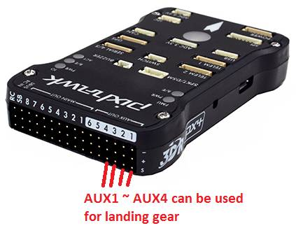

.. _landing-gear:

============
Landing Gear
============

Copter supports retractable Landing Gear activated by a servo mechanism
(like these sold by `Hobby King <http://www.hobbyking.com/hobbyking/store/__63508__Quanum_600_Class_Quick_Release_Universal_Retractable_Gear_Set_680UC_Pro_Hexa_Copter_.html>`__).
The gear can be manually retracted/deployed with an auxiliary switch and
there are several automatic features which enhance operational safety.

There is some simple logic controlling the operation beyond simply
responding to retract/deploy commands from the controller.  If the
APM:Copter system is booted up and the landing gear control switch is in
the retract position, the landing gear will not retract.  This is done
to prevent damage to the landing gear or airframe should the switch be
accidentally left in the retract position on start-up.  In this case,
the landing gear will not retract until the switch is first moved to the
deploy position, and then the retract position.

Furthermore, the landing gear will automatically deploy immediately upon
entering Land mode, as well as the landing phase of RTL mode, or an
auto-land in Auto mode.  This is especially important in the case of
radio failsafe RTL events, where it would not be possible for the pilot
to lower the gear manually.

If assigned to a 3-position switch, the middle position will not cause a
change in state of the landing gear.  In the future, this will be used
for an automatic mode, but this is not enabled for AC3.3.

.. note::

   Support for landing gear was introduced in AC 3.3

.. image:: ../images/LandingGear_HobbyKing.jpg
    :target: ../_images/LandingGear_HobbyKing.jpg

Connecting to the Pixhawk
=========================

Most retractable landing gear will require just a single PWM cable to
connected to one of the AUX outputs on the back of the Pixhawk (AUX1 ~
AUX4).

.. note::

   The signal wire (usually white) should be connected to the lower
   most "S" pin.

Setup through the Mission Planner
=================================

Use the Mission Planner's Full Parameter List (or equivalent) to set the
following parameters:

-  ``RCn_FUNCTION to 29`` "Landing Gear", where **n** is the number for
   the connected servo (e.g.
   :ref:`RC9_FUNCTION <RC9_FUNCTION>` for AUX1,
   :ref:`RC10_FUNCTION <RC10_FUNCTION>` for AUX2 etc.)
-  :ref:`LGR_SERVO_DEPLOY <LGR_SERVO_DEPLOY>`
   — servo PWM value required to deploy the landing gear.
-  :ref:`LGR_SERVO_RTRACT <LGR_SERVO_RTRACT>`
   — servo PWM value required to retract the landing gear.

   MissionPlanner: Landing Gear Configuration

Set Ch7 or Ch8 Opt to "Landing Gear" in order to enable manual control. 
When the switch is in the "low" position the gear will be deployed,
"high" will be retracted, "middle" will be a neutral position that will
not change state (will be used for automatic operation on a future
release).

   Mission Planner: Setting Manual Landing Gear Control
