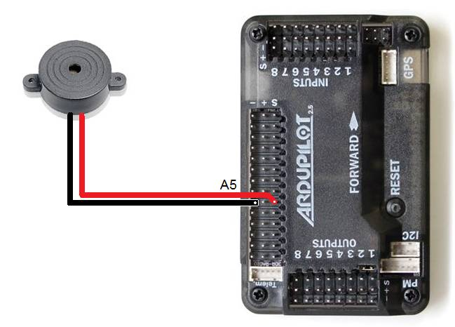
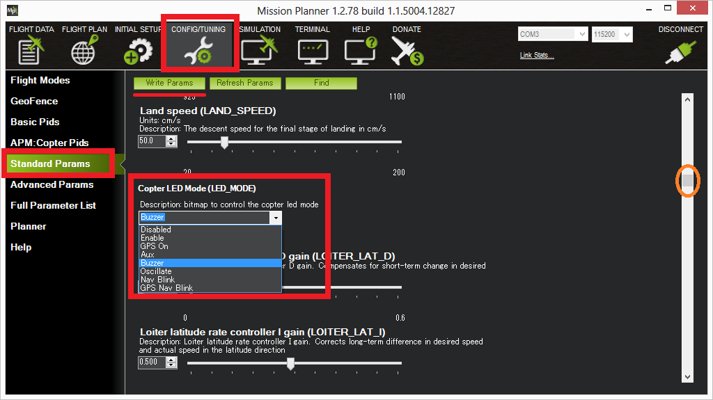

.. _nav-leds:

==============
Buzzer in APM2
==============

This article shows how to connect a buzzer to APM2 and how to
enable/disable the buzzer in Mission Planner.

Buzzer for APM2
===============

A piezo buzzer like `this one from jDrones <http://store.jdrones.com/APM_Info_Board_p/elledbuz01.htm>`__
can be connected directly to the APM's A5 pins.  If purchasing a
different piezo beeper, you must ensure that the piezo is internally
modulated, meaning that it creates it's own tone when simply driven with
a 5V input.  Some piezo beepers rely on external circuitry to create the
tone, this is typically done to play music with multiple notes, but the
APM is not capable of driving these.  If you hook up a piezo, and all
you hear is a "click", then you know it is not internally modulated.

Also note that any piezo beeper being used must have a current draw
below 40 mA.

Connect the buzzer as follows:

-  buzzer's red wire should be connected to the APM's A5's inner signal
   pin
-  buzzer's black wire should be connected to the outer ground pin

The buzzer will beep in these situations:

**Arming**: twice at the beginning of the arming procedure, and then
again twice when completed (Copter can take a long time to arm
especially the first time).

**Disarming**: once when the pilot disarms the copter

**Low Battery**: continuous tone when the battery voltage is low. The
only way to turn off the tone is to arm or disarm the copter.

Enabling a buzzer in Mission Planner
====================================

.. note::

   In AC3.2 the buzzer is always enabled, for AC3.1.5, the buzzer can
   be enabled/disabled through the Mission Planner's CONFIG/TUNING >
   Standard Params > Copter LED Mode drop down.

Video demonstration of connecting the buzzer is below.

..  youtube:: YNgpYy1ENKY
    :width: 100%
