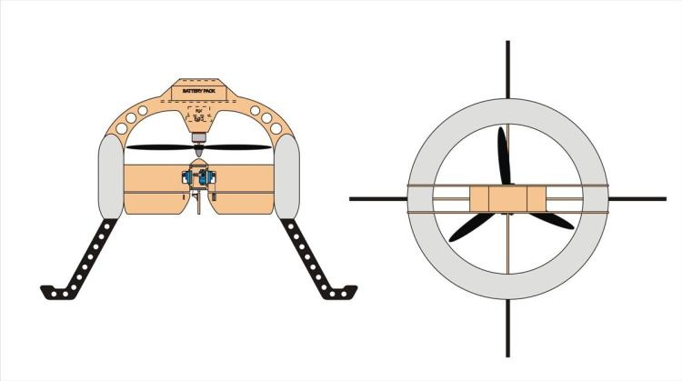

.. _singlecopter-and-coaxcopter:

===========================
SingleCopter and CoaxCopter
===========================

.. warning::

   Warning the SingleCopter (available since AC3.1) and CoaxCopter
   (available since AC3.2) are not regularly used and have not been
   extensively tested!

**As this is VERY new many of the Single copters shown here use either
mil-spec or very simple stabilize mode controllers.**

The First Video of a SingleCopter using an APM 2.5
==================================================

https://vimeo.com/77850133

SingleCopter
============

-  A SingleCopter is an aerial vehicle with one central rotating
   propeller thrusting downward past 4 controllable vanes.
-  The 4 control vanes (one in each quadrant) permits the control of the
   vehicles roll, pitch and yaw.
-  The vanes also permit real time compensation for the motors direction
   of rotation.
-  Altitude is controlled by adjusting the motor / propeller speed.

   |vtolcustom2|

**An innovative and quite successful hobbyist SingleCopter**

Connecting the Flight Controller to the SingleCopter:
-----------------------------------------------------

-  Connect the APM, PX4 or Pixhawk servo output channels 1-4 to the
   SingleCopters 4 control fins as shown.
-  Connect the APM, PX4 or Pixhawk servo output channel 7 to the ESC for
   the brushless motor that powers the main single rotor
-  The 4 fins are attached to four arms and it's a bit like a Plus quad.
-  Looking down on the APM from above as in the attached diagram.
   "servo1" would be attached to the APM's output channel #1, etc.

Load the Firmware
-----------------

-  For the time being, the user needs to compile the source code
   themselves.
-  Add this line to the APM_Config.h: \ **#define FRAME_CONFIG
   SINGLE_FRAME**
-  In the near future this will be added as a downloadable binary
   to \ **firmware.ardupilot.org** and likely as a Mission Planner
   loadable icon.

Configuration
=============

If digital servos are used the SV_SPEED parameter can be set to 125 (or
even higher).  If slower analog servos are used set this parameter to
50.

CoaxCopter
==========

-  A CoaxCopter is an aerial vehicle with two counter rotating central
   propellers thrusting downward past 2 controllable vanes (one side to
   side and the other from front to back) that permit control of roll
   and pitch.
-  Yaw is controlled by varying top and bottom propeller speeds relative
   to each other.
-  There are two variant motor configurations of the CoaxCopter:

   -  A contra-rotating motor pair with both Propellers on top and the
      shaft of the bottom motor passing up through the hollow shaft of
      the top motor
   -  And two motors mounted back to back with one propeller above and
      the other beneath with appropriate support struts.
   -  Both variations are illustrated below.

.. image:: ../images/vtol.jpg
    :target: ../_images/vtol.jpg

.. image:: ../images/mav_electric.jpg
    :target: ../_images/mav_electric.jpg

Connecting the Flight Controller to the CoaxCopter:
---------------------------------------------------

-  Connect the APM, PX4 or Pixhawk servo output channels 1 and 2 to the
   CoaxCopters two control fins servos as shown (Note: the diagram below
   is incorrect, "Servo3" should be "Servo1" and "Servo4" should be
   "Servo2").
-  Connect the APM, PX4 or Pixhawk servo output channel 3 and 4 to the
   ESC for the brushless motors that power the main dual rotors.
-  The two wide fins are attached to two cross arms and works a bit like
   the elevator and ailerons of a fixed wing plane.
-  Below is an illustration looking down on an APM/Pixhawk mounted on
   the frame.  Note the warning re Servo3 and Servo4 being mislabelled.

.. image:: ../images/CoaxCopterTopView1.jpg
    :target: ../_images/CoaxCopterTopView1.jpg

Load the Firmware
-----------------

-  For the time being, the user needs to compile the source code
   themselves.
-  Add this line to the APM_Config.h: \ **#define FRAME_CONFIG
   COAX_FRAME**
-  In the near future this will be added as a downloadable binary
   to \ **firmware.ardupilot.org** and likely as a Mission Planner
   loadable icon.

And a Video of a Research SingleCopter in action:

..  youtube:: FFiPbyigxVI#t=40
    :width: 100%

