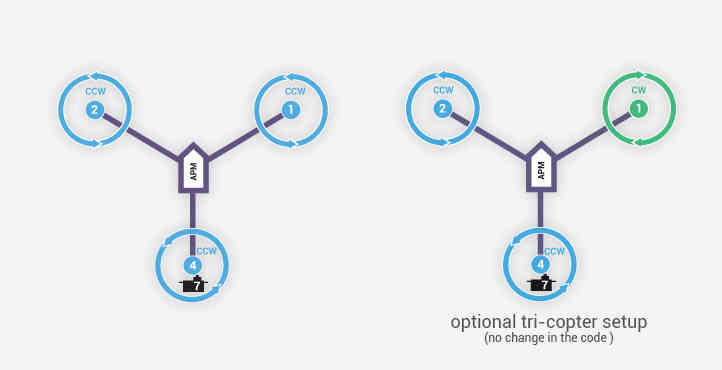

.. _tricopter:

=======================
Tricopter Configuration
=======================

This page outlines the special settings required to get a TriCopter
flying.  The more :ref:`general instructions for setting up a multicopter <initial-setup>` should
be used for all other aspects of the setup.

Copter 3.3 (and higher)
=======================

-  ``MOT_YAW_SV_MIN``: yaw servo's lowest PWM value before binding
   occurs.
-  ``MOT_YAW_SV_MAX``: yaw servo's highest PWM value before binding
   occurs.
-  ``MOT_YAW_SV_TRIM``: yaw servo's PWM value close to what is required
   to keep the tail from spinning.
-  ``MOT_YAW_SV_REV``: yaw servo's reverse setting.  +1 = servo moves in
   default direction, -1 to reverse direction of movement.

Copter 3.2.1 (and earlier)
==========================

-  ``RC7_MIN``: yaw servo's lowest PWM value before binding occurs.
-  ``RC7_MAX``: yaw servo's highest PWM value before binding occurs.
-  ``RC7_TRIM``: yaw servo's PWM value close to what is required to keep
   the tail from spinning.
-  ``RC7_REV``: yaw servo's reverse setting.  +1 = servo moves in
   default direction, -1 to reverse direction of movement.
