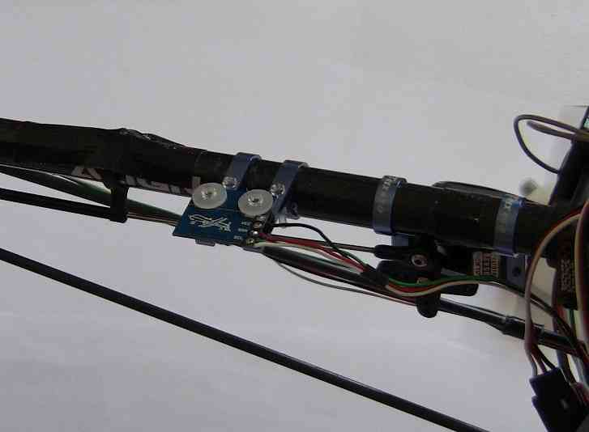

.. _using-a-magnetometer:

========================================
Traditional Helicopter – Using a Compass
========================================

Remote-mounted compass
======================

If you have your APM2.x located on the bottom of the heli frame near to
the motor you may well have a problem with your compass. On most helis
its worth using an external compass with APM2.5+. It costs an extra $40
but it's worth it. So locate both the GPS and compass together either on
top of the boom mount or ideally half-way back on the boom.

On a 450 it is best located on the boom mount because the heli is so
small that the weight of the GPS on the tail will be significant and
cause CG issues. However, on a 600 this is less of an issue so have both
mounted on the boom, halfway back. You still have to consider the CG,
but it's manageable. This sets the compass quite far away from all the
interference from the motor and works very well.

A good thing to test your compass is to use the Mission Planer and have
a GPS fix. Then go to the Google map and verify if the red line of the
Quad symbol fits the physical orientation of your Heli. If not adjust
the Declination in the hardware Compass setup. There is also a website
to show the Declination of your location.

Using a compass
===============

.. image:: ../images/BR-HMC5843-01-2.jpg
    :target: ../_images/BR-HMC5843-01-2.jpg

In order to correct for yaw gyro drift and to allow GPS position hold to
function, it is highly recommended that you use a `HMC5883L magnetometer (compass) <https://www.sparkfun.com/products/10530>`__.

The best way to mount the compass is to modify a \ `GPS cable <http://store.scoutuav.com/product/cables-connectors/gps-cable-10-cm/>`__,
cutting off the connector on one side and soldering the wires to the
pads on the compass board. The pins are even in the correct order but if
there is any doubt, you can look at the bottom of the shield where you
should see "SCL", "SDA", "+5V", "GND" written. These should be matched
up to the pins on the compass. You will need to make the cable
approximately 55cm long to reach from the APM to the compass on the
tail.

When mounting the compass, try to keep it as far away from any magnetic,
ferro-metallic (ie: steel), or electro-magnetic sources (ie: servos,
motors) as you can. In particular, do not use steel screws to mount the
board. Aluminum screws have been tested and do work, and of course nylon
screws would be an excellent choice.

The best place to mount the compass is on the tail boom close to the
body with components down and pins forward.

