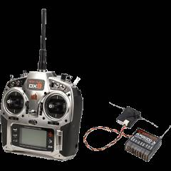
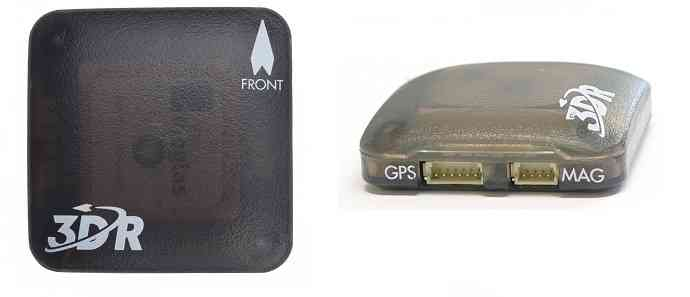
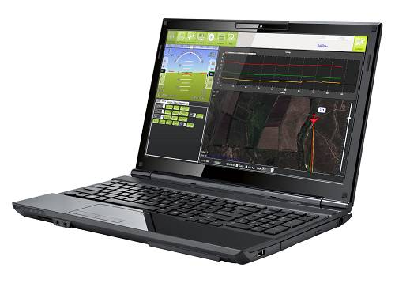
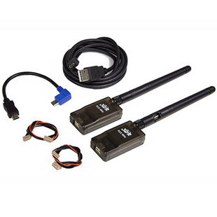

.. _what-you-need:

====================================
做一个多旋翼直升机，你需要哪些东西
====================================

本文概要论述做一个多旋翼直升机，你需要的主要组件。

机架（包括电机、电调、和螺旋桨）
=======================================================

当下有多种多样的机架、电调和电机可供选择。在选择的时候哪些是你需要考虑的，可以参照
:ref:`多旋翼直升机机架选择 <choosing-a-frame>` 和 
:ref:`载具组件细节 <common-common-airframe-builds>`中的相关讨论。

还有许多其他的设计和配置，包括传统直升机，我们的软件也是支持的。

至少支持6通道的遥控发射器和接收器
======================================

你需要用遥控发射器对直升机进行手动控制或者切换飞行模式。你可以选择任何遥控发射接收系统，唯一的要求是它最少支持6通道。相关的可选项在
 :ref:`兼容的遥控发射接收系统 (Pixhawk/PX4) <common-pixhawk-and-px4-compatible-rc-transmitter-and-receiver-systems>`中找到。

飞行控制板 (Autopilot兼容硬件)
============================================

本系统支持的自动驾驶板是支持自主飞行的。在本手册编写时(2015年12月)，强烈推荐大家使用
:ref:`Pixhawk <common-pixhawk-overview>` 

对于进行无人机视觉应用开发的工程师们，可以考虑使用独立的系统进行视频控制，也可以选择基于Linux系统的自动驾驶控制板（例如：
:ref:`NAVIO+ <common-navio-overview>` 或者
:ref:`Erle-Brain <common-erle-brain-linux-autopilot>`) 它们都可以运行Copter系统的同时进行图像处理。

更多选择，请参照 :ref:`飞行控制器选择 <common-choosing-a-flight-controller>`.

GPS 模块
==========

你的直升机*需要*一个GPS模块，推荐使用
:ref:`3DR UBlox GPS + 罗盘模块 <common-installing-3dr-ublox-gps-compass-module>` 它包含一个罗盘模块。你可以可以从这里
:ref:`其它GPS解决方案 <common-positioning-landing-page>` 选择其他模块

锂电池以及充电器
==========================

.. image:: ../images/lipo_battery.jpg
    :target: ../_images/lipo_battery.jpg

直升机还需要可以充电的锂电池，选择锂电池的经验做法是一个电机1,000mAH(毫安时)。对于四轴而言，
 `像这样的4,000mAH锂电池 <http://www.hobbyking.com/hobbyking/store/__9185__Turnigy_4000mAh_3S_20C_Lipo_Pack.html>`__
是比较好的选择。你的直升机飞行中使用一块电池，我们建议你至少备两块。电池越多飞的时间越长。你还需要一个
 `像这样的为你的电池充电的充电站 <http://hobbyking.com/hobbyking/store/__24289__Turnigy_2S_3S_Balance_Charger_Direct_110_240v_Input_USA_Warehouse_.html>`__.

地面控制站
======================

当你给你的直升机更新固件版本，做首飞的调试和校准时，免费有开源的 :ref:`Mission Planner <planner:home>`
是你需要的。它装载电脑上，也可以用来做任务规划。

你的直升机配置好以后，你可能尝试不同的地面站，看看哪个更适合自己-运行在平板上、手机上还是电脑上。常见的可选地面站可以在话题
:ref:`地面站的选择 <common-choosing-a-ground-station>` 中找到。

无线电遥测
===============

无线电遥测可以帮助你的直升机与你的地面站通信。可以实时地更新任务，接收你直升机上的摄像头或者其它组件的数据流。为你的飞行任务提供了极大的便利。

你可以从
:ref:`遥测登录页 <common-telemetry-landingpage>` 找到我们建议的无线电遥测解决方案。 切记，如果使用
:ref:`SIK Radio <common-sik-telemetry-radio>` ，你需要选择你的国家许可的频率的版本 - 915 MHz (美国)， 433
MHz (欧洲).

