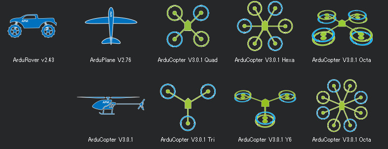

.. _home:

===========
直升机首页
===========

.. tip::
   ArduPilot 开发者社区生态体系正在建设中！`更多信息点击这里... <http://diydrones.com/profiles/blogs/a-new-chapter-in-ardupilot-development>`__

.. image:: /images/home_copter.jpg
    :target: _images/home_copter.jpg

..  raw:: html

    <table>
    <tr>
    <td width="48%">

|TOP_COL_LEFT|

..  raw:: html

    </td>
    <td width="4%">
    </td>
    <td width="48%">
    

|TOP_COL_RIGHT|    

..  raw:: html

    </td>
    </tr>
    </table>
    
..  raw:: html

    <table>
    <tr>
    <td width="48%">

.. image:: ../../images/mission_planner_spline_waypoint.jpg
    :target: _images/mission_planner_spline_waypoint.jpg
    :width: 350px
           
..  raw:: html

    </td>
    <td width="4%">
    </td>
    <td width="48%">

.. image:: ../../images/mission_planner_flight_data.jpg
   :target: _images/mission_planner_flight_data.jpg    
   :width: 350px

..  raw:: html

    </td>
    </tr>
    </table>

--------------

系统组件
~~~~~~~~~~~~~~~~~

-  写入最新版 :ref:`直升机固件 <http://firmware.ardupilot.org/>` 的 :ref:`Pixhawk <https://store.3dr.com/t/pixhawk>` 或者 :ref:`其他自动驾驶仪 <common-autopilots>` 
-  :ref:`任务规划软件 <planner:home>` -- 为你提供易于操作的可视化配置的全功能的地面控制界面。
-  本直升机手册，它可以为你提供关于多轴直升机或传统直升机设置、操作方面的一切信息。 
-  一个合适的
   :ref:`多轴直升机 <build-your-own-multicopter>` 或
   :ref:`传统直升机 <traditional-helicopters>` 。
-  还有许多有用的可选组件：例如无线传输设备，可以允许你在无人机和你的电脑之间通过双向无线进行遥测和控制。

--------------

旋翼航空器类型
~~~~~~~~~~~~~~~~~

..  raw:: html

    <table>
    <tr>
    <td width="48%">

.. image:: /images/helicopter_trex450.jpg
   :target: _images/helicopter_trex450.jpg 
   :width: 211px

..  raw:: html

    </td>
    <td width="4%">
    </td>
    <td width="48%">

.. image:: /images/3DR_arducopter_hexa_b_frame.jpg
   :target: _images/3DR_arducopter_hexa_b_frame.jpg
   :width: 211px

..  raw:: html

    </td>
    </tr>
    </table>

:ref:`多轴直升机 <what-is-a-multicopter-and-how-does-it-work>`:

-  利用电机-螺旋桨单元的推力差管理为直升机提供升力和方向控制
-  从机械的简单性和设计灵活性中受益
-  在强风条件下依然保持高有效载荷，非常实用
-  冗余电机配置可以提升安全边界
-  多变的外形使其可以有多种方式携带有效载荷。

:ref:`传统直升机 <traditional-helicopters>`:

-  通常实用携带两片或多片桨叶的单电机提供升力
-  通过伺服电机的机械联动来改变桨叶间距从而控制方向(存在多种不同版本的机械控制工艺，但关于这些工艺的讨论超出了本手册的范围-- 传统直升机中的机械系统有必要进行特殊的研究和思考) 
-  健壮、快速、高效--是一个适合执行多种任务的熟练工

由于它的开放式设计，直升机还只是更多不常用的架构类型，包括 :ref:`单轴或同轴直升机 <singlecopter-and-coaxcopter>` 。把这些和 :ref:`飞机 <plane:home>` , :ref:`滑翔机 <rover:home>` 和 :ref:`天线追踪 <antennatracker:home>` 放在一起，还有包括机器人系统，可以通过相似的界面操作完成各种任务的车辆。

--------------

更多信息
~~~~~~~~~~~~~~~~~

-  继续浏览 :ref:`本手册的简介部分。 <introduction>`
-  访问 `DIYDrones.com <http://diydrones.com/>`__ 这是一个大的无人机爱好者社区，主要关于ArduPilot家族的自动驾驶仪。
-  通过 `APM 论坛 <http://ardupilot.com/forum/viewforum.php?f=3>`__ 提问或者给出建议。
-  如果你已经做好准备参与软件平台的开发，欢迎订阅或者加入 `drones-discuss 邮件列表 <https://groups.google.com/forum/#!forum/drones-discuss>`__ 

.. toctree::
   :hidden:
   
   直升机简介 <docs/introduction>
   基本设置 <docs/initial-setup>
   试飞 <docs/flying-arducopter>
   高级配置 <docs/common-advanced-configuration>
   任务规划 <docs/common-mission-planning>
   任务分析 <docs/common-mission-analysis>
   可选硬件 <docs/common-optional-hardware>
   传统直升机 <docs/traditional-helicopters>
   三轴直升机 <docs/tricopter>
   单轴或同轴直升机 <docs/singlecopter-and-coaxcopter>
   自动驾驶设备 <docs/common-autopilots>
   应用和用例 <docs/common-use-cases-and-applications>
   天线追踪 <docs/common-antenna-tracking>
   模拟 <docs/common-simulation>
   附录 <docs/common-appendix>
   目录 <docs/common-table-of-contents>

.. |TOP_COL_LEFT| replace:: 这是一个全功能的 :ref:`开源 <dev:license-gplv3>`__
   多轴无人机控制系统，在2013和2014年度的 :ref:`Sparkfun自主交通工具竞赛 <https://avc.sparkfun.com/>`__
    中斩获大奖(称霸五大热点)。系统的开发团队来自全球各地，持续地对无人机的功能和性能进行改善和提升。    
   
.. |TOP_COL_RIGHT| replace:: 从快节奏的第一视角竞赛，到平滑的空中图像拍摄，
   再到全自主的高复杂度导航，直升机可以满足全方位的飞行需求。
   它可以通过优雅的、易于开发的、四位一体的软件地面站进行编程开发。
   整个软件包基于高安全性、多功能性、开放式设计，
   易于开发定制化应用，甚至初学者也非常容易上手。   

