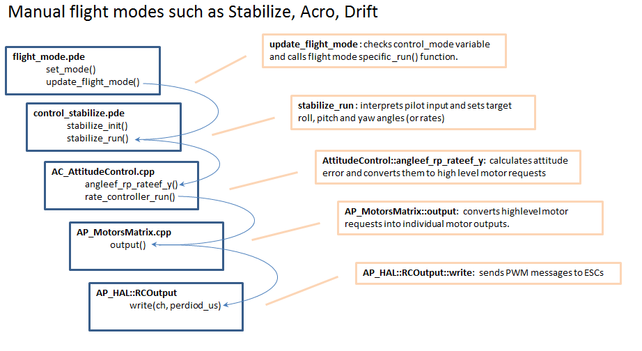
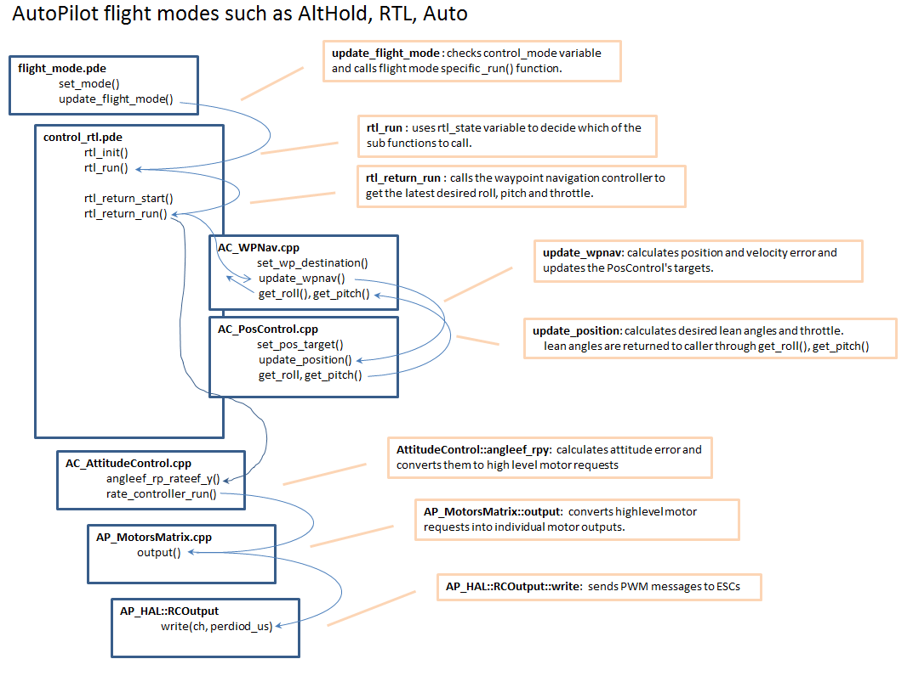

.. _apmcopter-code-overview:

======================
Code Overview (Copter)
======================

The `code <https://github.com/ArduPilot/ardupilot>`__ is made up
of `the main Copter code <https://github.com/ArduPilot/ardupilot/tree/master/ArduCopter>`__ which
resides in it's own directory, and `the libraries <https://github.com/ArduPilot/ardupilot/tree/master/libraries>`__ which
are shared with Plane and Rover.

Click on the images below to see a high level view of flight-mode to
motor output code:

Sections:

.. toctree::
    :maxdepth: 1

    Library description <apmcopter-programming-libraries>
    Attitude Control <apmcopter-programming-attitude-control-2>
    Adding Parameters <code-overview-adding-a-new-parameter>
    Adding a new flight mode <apmcopter-adding-a-new-flight-mode>
    Scheduling your new code to run intermittently <code-overview-scheduling-your-new-code-to-run-intermittently>
    Adding a new MAVLink message <code-overview-adding-a-new-mavlink-message>
    Adding a new MAVLink Gimbal <code-overview-adding-support-for-a-new-mavlink-gimbal>