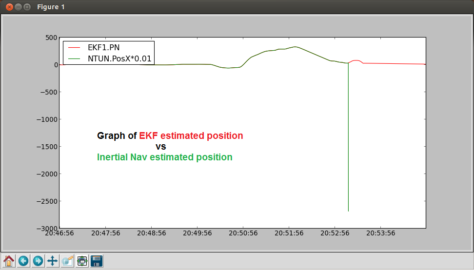
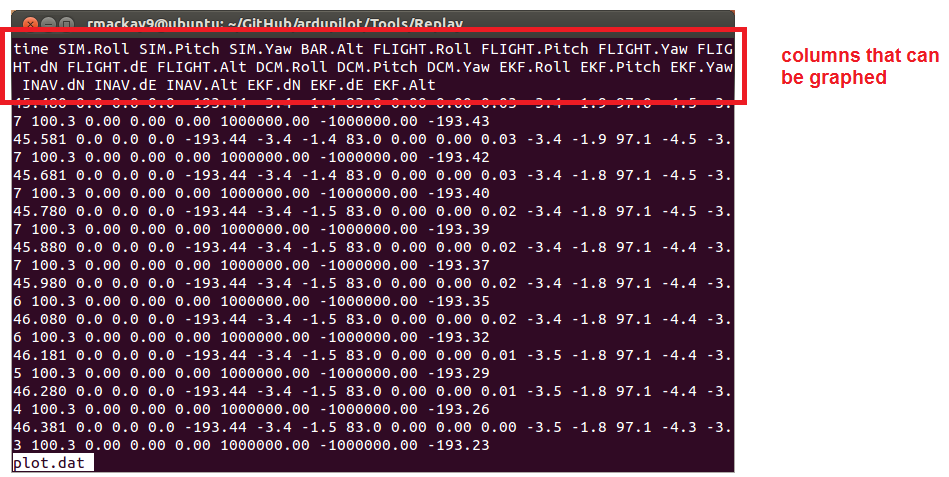

.. _testing-with-replay:

===================
Testing with Replay
===================

Introduction
============

Replay is a program that takes the output from a dataflash log file and
replays it through the latest master code allowing a sort of simulation
based on real data.  This can be useful when trying to recreate the
exact situation which produces a bug or to test EKF tuning parameters to
see how they would have performed in the same situation. Replay only
runs on Linux/Ubuntu and only using dataflash logs from a high speed CPU
such as the PX4/Pixhawk running a version of Copter/Plane/Rover from May
2014 or later (i.e. AC3.2-dev or higher).

Dataflash log messages required for Replay
==========================================

To use Replay the following dataflash messages must be enabled:

AHRS2, BARO, EKF1, EKF2, EKF3, EKF4, GPS, IMU, IMU2, MAG, MAG2

Building Replay
===============

On your Linux or Ubuntu machine:

``cd ../ardupilot/Tools/Replay``

make linux

This should create a file called ``/tmp/Replay.build/Replay.elf``

Using Replay
============

Put the dataflash log file you wish to analyse into the
``../ardupilot/Tools/Replay`` directory.

Display the Replay help instructions:

``/tmp/Replay.build/Replay.elf -- -h``

Run a log through Replay to generate the plot and EKF data files:

``/tmp/Replay.build/Replay.elf -- -r400 MyLogFile.BIN``

Note: the -r400 means the main loop is running at 400hz which is correct
for Copter. For Plane and Rover this can be omitted or replaced with
``-r50``

This will produce six output files: plot.dat, plot2.dat, EKF1.dat,
EKF2.dat, EKF3.dat, EKF4.dat

Look at the raw data to see which values are available to be plotted:

``less plot.dat`` (you can replace ``plot.dat`` with any of the other
six files produced)

Use the simple plotit.sh script to graph some data. Below is the command
to compare the EKF calculated altitude with the older Inertial Nav
calculated altitude and the flight's actual altitude.

``./plotit.sh EKF.Alt INAV.Alt FLIGHT.Alt``

.. image:: ../images/Replay_EKFInavFlightAlt.png
    :target: ../_images/Replay_EKFInavFlightAlt.png

Use the more complex mavgraph.py to graph the data

``mavgraph.py MyLogFile.BIN EKF1.PN NTUN.PosX*0.01``

This example compares the EKF estimated North-South position from home
vs the older Inertial Nav estimated position. See image at the top of
this page for the resulting graph.

Changing parameters
===================

Simulation parameters may be changed before replaying a log using the
option: ``-pNAME=VALUE`` (this sets the parameter ``NAME`` to
``VALUE``). The parameters which may be edited are those listed by
running the `:ref:`param show`` command in `SITL <setting-up-sitl-on-linux>`.

For example, to change the EKF velocity delay parameter from 220ms to
400ms, run the command:

::

    /tmp/Replay.build/Replay.elf -- -pEKF_VEL_DELAY=400 MyLogFile.Bin
