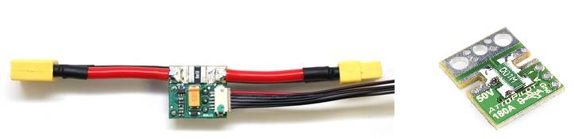
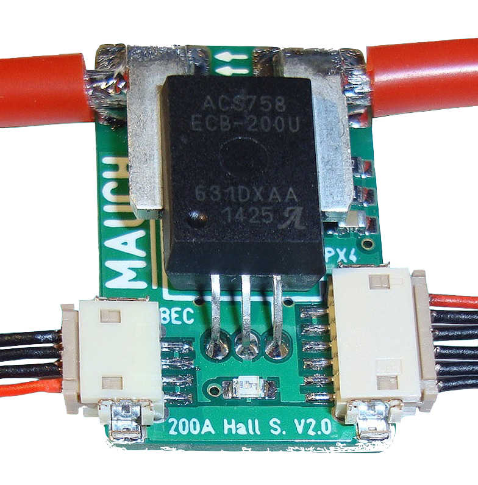
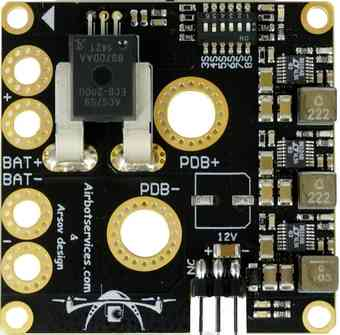

.. _common-powermodule-landingpage:

============================
Power Modules (landing page)
============================

If possible it is best to power your Pixhawk, PX4 or APM flight
controller with a :ref:`3DR power module <common-3dr-power-module>` to
reduce the chances of a brownout.  The links below have information
about these modules and other alternatives.

.. toctree::
    :maxdepth: 1

    AttoPilot Current Sensor <common-using-a-current-sensor>
    Mauch Power Modules <common-mauch-power-modules>
    AirbotPower Power Module <common-airbotpower-power-module>
    3DR Power Module <common-3dr-power-module>
    Power Module Configuration <common-power-module-configuration-in-mission-planner>

