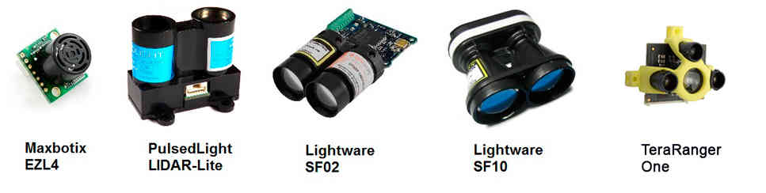

.. _common-rangefinder-landingpage:

===========================
Rangefinders (landing page)
===========================

Copter/Plane/Rover support a number of different rangefinders including
Maxbotix Sonar and Pulsed Light LED range finders.

.. tip::

   If you get a "Bad LiDAR Health" message in *Mission Planner* this
   is caused because the rangefinder isn't enabled for landing.  This is
   done through the ``RNGFND_LANDING`` parameter and if set you should see
   the message disappear.

Follow the links below (or in sidebar) for configuration information
based upon your set-up.

.. toctree::
    :maxdepth: 1
    

    LIDAR-Lite <common-rangefinder-lidarlite>
    Maxbotic I2C Sonar <common-rangefinder-maxbotixi2c>
    Maxbotic Analog Sonar <common-rangefinder-maxbotix-analog>
    Lightware SF02 <common-rangefinder-sf02>
    LightWare SF10 Lidar <common-lightware-sf10-lidar>
    TeraRanger One Rangefinder <common-teraranger-one-rangefinder>

    

