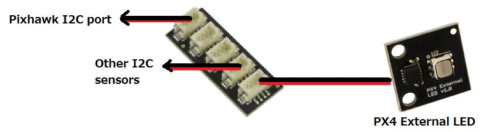

.. _common-external-leds:

=============
External LEDs
=============

This article shows how to connect external LEDs.

External LED for Pixhawk
========================

An external Pixhawk LED can be added by connecting it to the Pixhawk's
I2C port. Because most users use an `Ublox GPS and Compass module <https://store.3dr.com/products/3dr-gps-ublox-with-compass>`__,
an `I2C splitter <http://store.jdrones.com/Pixhawk_I2C_splitter_p/dstpx4i2c01.htm>`__
is recommended.  Once connected the similar LED on the center of the
Pixhawk will no longer light up.

