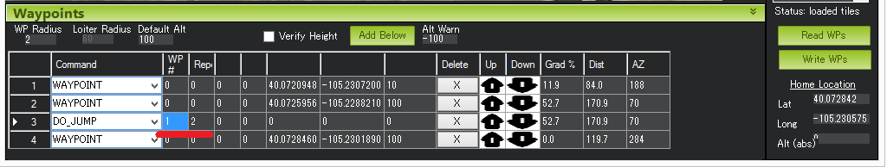
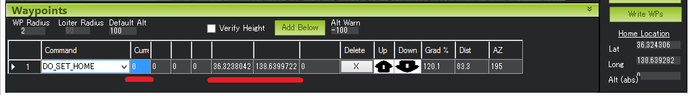
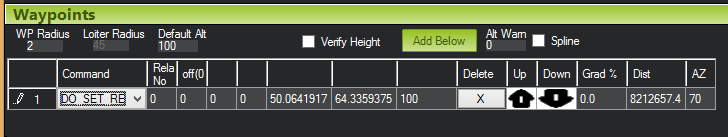
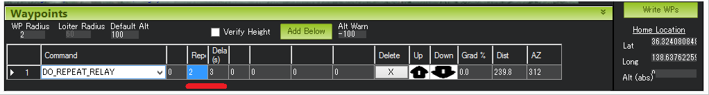
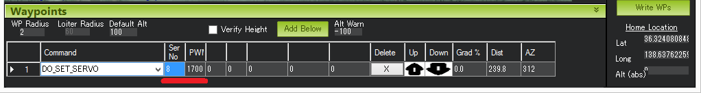
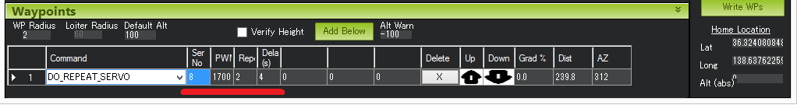
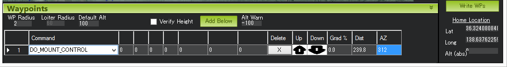
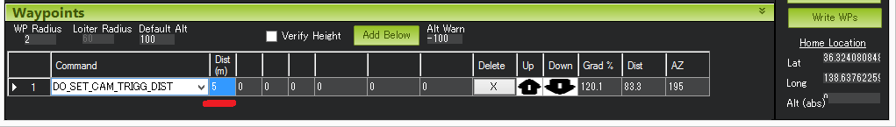

.. _common-mavlink-mission-command-messages-mav_cmd:

==========================================
MAVLink Mission Command Messages (MAV_CMD)
==========================================

This article describes the specific set of mission commands and
parameters that are supported by Copter, Plane and Rover.

.. warning::

   This is a WORK IN PROGRESS. It has not been reviewed, and is
   full of questions/actions (usually preceded by "#HW" or "TODO". The list
   of what commands are supported in each platform are likely to be
   correct. The copter-specific documentation is more likely to be correct
   as it is based on existing copter mission docs. 

Overview
========

The MAVLink protocol defines a large number of
`MAV_CMD <https://github.com/mavlink/mavlink/blob/master/message_definitions/v1.0/common.xml#L531>`__
waypoint command types (sent in a ``MAVLink_mission_item_message``).
ArduPilot implements handling for the subset of these commands and
command-parameters that are *most relevant* and meaningful for each of
the vehicles. Unsupported commands that are sent to a particular
autopilot will simply be dropped.

This article lists and describes the commands and command-parameters
that are supported on each of the vehicle types. Any parameter that is
"grey" is not supported by the autopilot and will be ignored (they are
still documented to make it clear which properties that are supported by
the `MAV_CMD protocol <https://github.com/mavlink/mavlink/blob/master/message_definitions/v1.0/common.xml#L531>`__
are not implemented by the vehicle.

Some commands and command-parameters are not implemented because they
are not relevant for particular vehicle types (for example
"MAV_CMD_NAV_TAKEOFF" command makes sense for Plane and Copter but
not Rover, and the pitch parameter only makes sense for Plane). There
are also some potentially useful command-parameters that are not handled
because there is a limit to the message size, and a decision has been
made to prioritise some parameters over others.

.. note::

   There is additional information about the supported commands on
   Copter (from a Mission Planner perspective) in the :ref:`Copter Mission Command List <copter:mission-command-list>`.

Types of commands
-----------------

There are several different types of commands that can be used within
missions:

-  Navigation commands are used to control the movement of the vehicle,
   including takeoff, moving to and around waypoints, changing altitude,
   and landing.
-  DO commands are for auxiliary functions and do not affect the
   vehicle’s position (for example, setting the camera trigger distance,
   or setting a servo value).
-  Condition commands are used to delay DO commands until some condition
   is met, for example the UAV reaches a certain altitude or distance
   from the waypoint.

During a mission at most one “Navigation” command and one “Do” or
"Condition" command can be running at one time. A typical mission might
set a waypoint (NAV command), add a CONDITION command that doesn't
complete until a certain distance from the destination
(:ref:`MAV_CMD_CONDITION_DISTANCE <mav_cmd_condition_distance>`), and
then add a number of DO commands that are executed sequentially (for
example
:ref:`MAV_CMD_DO_SET_CAM_TRIGG_DIST <mav_cmd_do_set_cam_trigg_dist>`
to take pictures at regular intervals) when the condition completes.

.. note::

   CONDITION and DO commands are associated with the preceding NAV
   command: if the UAV reaches the waypoint before these commands are
   executed, the next NAV command is loaded and they will be
   skipped.

.. _common-mavlink-mission-command-messages-mav_cmd_navigation_commands_frames:

Frames of reference
-------------------

Many of the commands (in particular the :ref:`NAV\_ commands <common-mavlink-mission-command-messages-mav_cmd_navigation_commands>`) include position/location
information. The information is provided relative to a particular "frame
of reference", which is specified in the message's :ref:`common-mavlink-mission-command-messages-mav_cmd_navigation_commands_frames` field. Copter and Rover Mission use :ref:`MAV_CMD_DO_SET_HOME <mav_cmd_do_set_home>` command to set the
"home position" in the global coordinate frame (MAV_FRAME_GLOBAL),
`WGS84 coordinate system <https://en.wikipedia.org/wiki/World_Geodetic_System>`__, where
altitude is relative to mean sea level. All other commands use the
MAV_FRAME_GLOBAL_RELATIVE_ALT frame, which uses the same latitude
and longitude, but sets altitude as relative to the *home position*
(home altitude = 0).

Plane commands can additionally use MAV_FRAME_GLOBAL_TERRAIN_ALT
frame of reference. This again has the same WGS84 frame of reference for
latitude/Longitude, but specifies altitude relative to ground height (as
defined in a terrain database).

.. note::

   The other frame types defined in the MAVLink protocol (see
   `MAV_FRAME <https://github.com/mavlink/mavlink/blob/master/message_definitions/v1.0/common.xml#L434>`__)
   are not supported for mission commands.

How accurate is the information?
--------------------------------

If a command or parameter is marked as supported then it is likely (but
not guaranteed) that it will behave as indicated. If a command or
parameter is not listed (or marked as not supported) then it is
extremely likely that it is not supported on ArduPilot.

The reason for this is that the information was predominantly inferred
by inspecting the command handlers for messages:

-  The `switch statement in `AP_Mission::mavlink_to_mission_cmd <https://github.com/ArduPilot/ardupilot/blob/master/libraries/AP_Mission/AP_Mission.cpp#L466>`__
   was inspected to determine which commands are handled by *all*
   vehicle platforms, and which parameters from the message are stored.
-  The command handler switch for each vehicle type
   (`Plane <https://github.com/ArduPilot/ardupilot/blob/master/ArduPlane/commands_logic.cpp#L33>`__,
   `Copter <https://github.com/ArduPilot/ardupilot/blob/master/ArduCopter/commands_logic.cpp#L49>`__,
   `Rover <https://github.com/ArduPilot/ardupilot/blob/master/APMrover2/commands_logic.cpp#L25>`__)
   tells us which commands are likely to be supported in each vehicle
   and which parameters are passed to the handler.

The above checks give a very accurate picture of what commands and
parameters are not supported. They gives a fairly accurate picture of
what commands/parameters are *likely to be supported*. However this
indication is not guaranteed to be accurate because a command handler
could just throw away all the information (and we have not fully checked
all of these).

In addition to the above checks, we have also merged information from
the :ref:`Copter Mission Command List <copter:mission-command-list>`.

How to interpret the commands parameters
----------------------------------------

The parameters for each command are listed in a table. The parameters
that are "greyed out" are not supported. The command field column (param
name) uses "bold" text to indicate those parameters that are defined in
the protocol (normal text is used for "empty" parameters).

This allows users/developers to see both what is supported, and what
protocol fields are not supported in ArduPilot.

Using this information with a GCS
---------------------------------

*Mission Planner* (MP) exposes the full subset of commands and
parameters supported by ArduPilot, filtered to display just those
relevant to the currently connected vehicle. Mapping the MP commands to
this documentation is easy, because it simply names commands using a
cut-down version of the full command name (e.g. ``DO_SET_SERVO`` rather
than the full command name: ``MAV_CMD_DO_SET_SERVO``). In addition, this
document conveniently lists the column label used by Mission Planner
alongside each of the parameters.

Other GCSs (APM Planner 2, Tower etc.) may support some other subset of
commands/parameters and use alternative names/labels for them. In most
cases the mapping should be obvious.

.. _commands_supported_by_rover:

.. _common-mavlink-mission-command-messages-mav_cmd_commands_supported_by_rover:

Commands supported by Rover
===========================

This list of commands was inferred from the command handler in
`/APMrover2/commands_logic.cpp <https://github.com/ArduPilot/ardupilot/blob/master/APMrover2/commands_logic.cpp#L25>`__. 

:ref:`MAV_CMD_NAV_WAYPOINT <mav_cmd_nav_waypoint>`

:ref:`MAV_CMD_NAV_RETURN_TO_LAUNCH <mav_cmd_nav_return_to_launch>`

:ref:`MAV_CMD_CONDITION_DELAY <mav_cmd_condition_delay>`

:ref:`MAV_CMD_CONDITION_DISTANCE <mav_cmd_condition_distance>`

:ref:`MAV_CMD_DO_CHANGE_SPEED <mav_cmd_do_change_speed>`

:ref:`MAV_CMD_DO_SET_HOME <mav_cmd_do_set_home>`

:ref:`MAV_CMD_DO_SET_SERVO <mav_cmd_do_set_servo>`

:ref:`MAV_CMD_DO_SET_RELAY <mav_cmd_do_set_relay>`

:ref:`MAV_CMD_DO_REPEAT_SERVO <mav_cmd_do_repeat_servo>`

:ref:`MAV_CMD_DO_REPEAT_RELAY <mav_cmd_do_repeat_relay>`

:ref:`MAV_CMD_DO_DIGICAM_CONFIGURE <mav_cmd_do_digicam_configure>`
(Camera enabled only)

:ref:`MAV_CMD_DO_DIGICAM_CONTROL <mav_cmd_do_digicam_control>` (Camera
enabled only)

:ref:`MAV_CMD_DO_MOUNT_CONTROL <mav_cmd_do_mount_control>`

:ref:`MAV_CMD_DO_SET_CAM_TRIGG_DIST <mav_cmd_do_set_cam_trigg_dist>`
(Camera enabled only)

:ref:`MAV_CMD_DO_SET_ROI <mav_cmd_do_set_roi>` (Gimbal/mount enabled
only)

:ref:`MAV_CMD_DO_SET_MODE <mav_cmd_do_set_mode>`

:ref:`MAV_CMD_DO_JUMP <mav_cmd_do_jump>`

.. _common-mavlink-mission-command-messages-mav_cmd_navigation_commands:

Navigation commands
===================

Navigation commands are used to control the movement of the vehicle,
including takeoff, moving to and around waypoints, and landing.

NAV commands have the highest priority. Any DO\_ and CONDITION\_
commands that have not executed when a NAV command is loaded are skipped
(for example, if a waypoint completes and the NAV command for another
waypoint is loaded, and unexecuted DO/CONDITION commands associated with
the first waypoint are dropped.

.. _mav_cmd_nav_waypoint:

MAV_CMD_NAV_WAYPOINT
-----------------------

Supported by: Copter, Plane, Rover.

Navigate to the specified position.

Rover
~~~~~

Change the target horizontal speed and/or the vehicle's throttle.

**Command parameters**

.. raw:: html

   <table border="1" class="docutils">
   <tbody>
   <tr>
   <th>Command Field</th>
   <th>Mission Planner Field</th>
   <th>Description</th>
   </tr>
   <tr>
   <td><strong>param1</strong></td>
   <td>Delay</td>
   <td>Hold time at mission waypoint in decimal seconds - MAX 65535 seconds. (Copter/Rover only)</td>
   </tr>
   <tr style="color: #c0c0c0">
   <td><strong>param2</strong></td>
   <td></td>
   <td>Acceptance radius in meters (when plain inside the sphere of this radius, the waypoint is considered reached) (Plane only).</td>
   </tr>
   <tr style="color: #c0c0c0">
   <td>param3</td>
   <td></td>
   <td>0 to pass through the WP, if > 0 radius in meters to pass by WP.
   Positive value for clockwise orbit, negative value for counter-clockwise
   orbit. Allows trajectory control.
   </td>
   </tr>
   <tr style="color: #c0c0c0">
   <td>param4</td>
   <td></td>
   <td>Desired yaw angle at waypoint target.(rotary wing)</td>
   </tr>
   <tr>
   <td><strong>param5</strong></td>
   <td>Lat</td>
   <td>Target latitude. If zero, the Copter will hold at the current latitude.</td>
   </tr>
   <tr>
   <td><strong>param6</strong></td>
   <td>Lon</td>
   <td>Target longitude. If zero, the Copter will hold at the current longitude.</td>
   </tr>
   <tr>
   <strong>param7</strong>
   <td>Alt</td>
   <td>Target altitude. If zero, the Copter will hold at the current altitude.</td>
   </tr>
   </tbody>
   </table>

.. _mav_cmd_nav_takeoff:

MAV_CMD_NAV_TAKEOFF
----------------------

Supported by: Copter, Plane (not Rover).

Takeoff (either from ground or by hand-launch). It should be the first
command of nearly all Plane and Copter missions.

.. _mav_cmd_nav_loiter_unlim:

MAV_CMD_NAV_LOITER_UNLIM
----------------------------

Supported by: Copter, Plane (not Rover).

Loiter at the specified location for an unlimited amount of time.

.. _mav_cmd_nav_loiter_turns:

MAV_CMD_NAV_LOITER_TURNS
----------------------------

Supported by: Copter, Plane (not Rover).

Loiter (circle) the specified location for a specified number of turns.

.. _mav_cmd_nav_loiter_time:

MAV_CMD_NAV_LOITER_TIME
-----------------------

Supported by: Copter, Plane (not Rover).

Loiter at the specified location for a set time (in seconds).

.. _mav_cmd_nav_return_to_launch:

MAV_CMD_NAV_RETURN_TO_LAUNCH
---------------------------------

Supported by: Copter, Plane, Rover.

Return to the *home location* or the nearest `Rally
Point <common-rally-points>`__, if closer. The home location is where
the vehicle was last armed (or when it first gets GPS lock after arming
if the vehicle configuration allows this).

#HW TODO / Questions - Randy: Check that copter still uses RTL_ALT
parameter and doesn't try to send information about height in the
package.

Rover
~~~~~

Return to the *home location* (Rally Points are not supported on Rover).

This command takes no parameters and generally should be the last
command in the mission.

**Command parameters**

.. raw:: html

   <table border="1" class="docutils">
   <tbody>
   <tr>
   <th>Command Field</th>
   <th>Mission Planner Field</th>
   <th>Description</th>
   </tr>
   <tr style="color: #c0c0c0">
   <td>param1</td>
   <td></td>
   <td>Empty</td>
   </tr>
   <tr style="color: #c0c0c0">
   <td>param2</td>
   <td></td>
   <td>Empty</td>
   </tr>
   <tr style="color: #c0c0c0">
   <td>param3</td>
   <td></td>
   <td>Empty</td>
   </tr>
   <tr style="color: #c0c0c0">
   <td>param4</td>
   <td>
   </td>
   <td>Empty</td>
   </tr>
   <tr style="color: #c0c0c0">
   <td>param5</td>
   <td></td>
   <td>Empty</td>
   </tr>
   <tr style="color: #c0c0c0">
   <td>param6</td>
   <td></td>
   <td>Empty</td>
   </tr>
   <tr style="color: #c0c0c0">
   <td>param7</td>
   <td></td>
   <td>Empty</td>
   </tr>
   </tbody>
   </table>

.. _mav_cmd_nav_land:

MAV_CMD_NAV_LAND
-------------------

Supported by: Copter, Plane (not Rover).

Land the vehicle at the current or a specified location.

.. _mav_cmd_nav_continue_and_change_alt:

MAV_CMD_NAV_CONTINUE_AND_CHANGE_ALT
-----------------------------------------

Supported by: Plane (not Copter, Rover).

Continue on the current course and climb/descend to specified altitude.
Move to the next command when the desired altitude is reached.

.. _mav_cmd_nav_spline_waypoint:

MAV_CMD_NAV_SPLINE_WAYPOINT
---------------------------

Supported by: Copter (not Plane or Rover).

Navigate to the target location using a spline path.

.. _mav_cmd_nav_guided_enable:

MAV_CMD_NAV_GUIDED_ENABLE
-------------------------

Supported by: Copter (not Plane or Rover).

Enable ``GUIDED`` mode to hand over control to an external controller.

See also :ref:`MAV_CMD_DO_GUIDED_LIMITS <mav_cmd_do_guided_limits>`
for information on how to apply time, altitude and distance limits on
the external control.

.. _mav_cmd_nav_altitude_wait:

MAV_CMD_NAV_ALTITUDE_WAIT
-------------------------

Supported by: Plane (not Copter or Rover).

Mission command to wait for an altitude or downwards vertical speed.

.. _mav_cmd_nav_loiter_to_alt:

MAV_CMD_NAV_LOITER_TO_ALT
------------------------------

Supported by: Plane (not Copter or Rover).

Begin loiter at the specified Latitude and Longitude. If Lat=Lon=0, then
loiter at the current position. Don't consider the navigation command
complete (don't leave loiter) until the altitude has been reached.
Additionally, if the Heading Required parameter is non-zero the aircraft
will not leave the loiter until heading toward the next waypoint.

.. _mav_cmd_do_jump:

MAV_CMD_DO_JUMP
------------------

Supported by: Copter, Plane, Rover.

Jump to the specified command in the mission list. The jump command can
be repeated either a specified number of times before continuing the
mission, or it can be repeated indefinitely.

.. tip::

   Despite the name, this command is really a "NAV\_" command rather
   than a "DO\_" command. Conditional commands like CONDITION_DELAY don't
   affect DO_JUMP (it will always perform the jump as soon as it reaches
   the command).

.. note::

   -  This command can be called a maximum number of 15 times in a mission,
      after which new DO_JUMP commands are ignored. The maximum number
      changed from 3 to 15 in AC 3.3.
   -  The command was introduced in/works reliably from AC3.2

**Command parameters**

.. raw:: html

   <table border="1" class="docutils">
   <tbody>
   <tr>
   <th>Command Field</th>
   <th>Mission Planner Field</th>
   <th>Description</th>
   </tr>
   <tr>
   <td><strong>param1</strong></td>
   <td>WP#</td>
   <td>The command index/sequence number of the command to jump to.</td>
   </tr>
   <tr>
   <td><strong>param2</strong></td>
   <td>Repeat#</td>
   <td>Number of times that the DO_JUMP command will execute before moving to
   the next sequential command. If the value is zero the next command will
   execute immediately. A value of -1 will cause the command to repeat
   indefinitely.
   </td>
   </tr>
   <tr style="color: #c0c0c0">
   <td>param3</td>
   <td></td>
   <td>Empty</td>
   </tr>
   <tr style="color: #c0c0c0">
   <td>param4</td>
   <td></td>
   <td>Empty</td>
   </tr>
   <tr style="color: #c0c0c0">
   <td>param5</td>
   <td>
   </td>
   <td>Empty</td>
   </tr>
   <tr style="color: #c0c0c0">
   <td>param6</td>
   <td>
   </td>
   <td>Empty</td>
   </tr>
   <tr style="color: #c0c0c0">
   <td>param7</td>
   <td></td>
   <td>Empty</td>
   </tr>
   </tbody>
   </table>

**Mission planner screenshots**

   Copter: Mission Planner Settings forDO_JUMP command

In the example above the vehicle would fly back-and-forth between
waypoints #1 and #2 a total of 3 times before flying on to waypoint #4.

Conditional commands
====================

Conditional commands control the execution of \_DO\_ commands. For
example, a conditional command can prevent DO commands executing based
on a time delay, until the vehicle is at a certain altitude, or at a
specified distance from the next target position.

A conditional command may not complete before reaching the next
waypoint. In this case, any unexecuted \_DO\_ commands associated with
the last waypoint will be skipped.

.. _mav_cmd_condition_delay:

MAV_CMD_CONDITION_DELAY
--------------------------

Supported by: Copter, Plane, Rover.

After reaching a waypoint, delay the execution of the next conditional
"_DO_" command for the specified number of seconds (e.g.
:ref:`MAV_CMD_DO_SET_ROI <mav_cmd_do_set_roi>`).

.. note::

   This command does not stop the vehicle. If the vehicle reaches the
   next waypoint before the delay timer completes, the delayed "_DO_"
   commands will never trigger.

**Command parameters**

.. raw:: html

   <table border="1" class="docutils">
   <tbody>
   <tr>
   <th>Command Field</th>
   <th>Mission Planner Field</th>
   <th>Description</th>
   </tr>
   <tr>
   <td><strong>param1</strong></td>
   <td>Time (sec)</td>
   <td>Delay in seconds (decimal).</td>
   </tr>
   <tr style="color: #c0c0c0">
   <td>param2</td>
   <td>
   </td>
   <td>Empty</td>
   </tr>
   <tr style="color: #c0c0c0">
   <td>param3</td>
   <td></td>
   <td>Empty</td>
   </tr>
   <tr style="color: #c0c0c0">
   <td>param4</td>
   <td></td>
   <td>Empty</td>
   </tr>
   <tr style="color: #c0c0c0">
   <td>param5</td>
   <td></td>
   <td>Empty</td>
   </tr>
   <tr style="color: #c0c0c0">
   <td>param6</td>
   <td></td>
   <td>Empty</td>
   </tr>
   <tr style="color: #c0c0c0">
   <td>param7</td>
   <td></td>
   <td>Empty</td>
   </tr>
   </tbody>
   </table>

**Mission planner screenshots**

.. figure:: ../../../images/MissionList_ConditionDelay.png
   :target: ../_images/MissionList_ConditionDelay.png

   Copter: Mission Planner Settingsfor CONDITION_DELAY command

In the example above, Command #4 (``DO_SET_ROI``) is delayed so that it
starts 5 seconds after the vehicle has passed Waypoint #2.

.. _mav_cmd_condition_change_alt:

MAV_CMD_CONDITION_CHANGE_ALT
--------------------------------

Supported by: Copter, Plane (not Rover).

Ascend/descend at a specified rate to a given altitude (will override
the value used in the following Waypoint). Any "_DO_" commands
associated with the waypoint will be delayed until the desired altitude
is reached.

#HW TODO / Questions: Is this the same for plane and copter (confirm).
What is the MP value for param 1 (ascent/descent rate)

**Command parameters**

.. raw:: html

   <table border="1" class="docutils">
   <tbody>
   <tr>
   <th>Command Field</th>
   <th>Mission Planner Field</th>
   <th>Description</th>
   </tr>
   <tr>
   <td><strong>param1</strong></td>
   <td>Rate (cm/sec)</td>
   <td>Descent / Ascend rate (m/s).</td>
   </tr>
   <tr style="color: #c0c0c0">
   <td>param2</td>
   <td>
   </td>
   <td>Empty</td>
   </tr>
   <tr style="color: #c0c0c0">
   <td>param3</td>
   <td>
   </td>
   <td>Empty</td>
   </tr>
   <tr style="color: #c0c0c0">
   <td>param4</td>
   <td>
   </td>
   <td>Empty</td>
   </tr>
   <tr style="color: #c0c0c0">
   <td>param5</td>
   <td>
   </td>
   <td>Empty</td>
   </tr>
   <tr style="color: #c0c0c0">
   <td>param6</td>
   <td>
   </td>
   <td>Empty</td>
   </tr>
   <tr>
   <td><strong>param7</strong></td>
   <td>Alt</td>
   <td>Target altitude</td>
   </tr>
   </tbody>
   </table>

.. _mav_cmd_condition_distance:

MAV_CMD_CONDITION_DISTANCE
--------------------------

Supported by: Copter, Plane, Rover.

Delays the start of the next "``_DO_``\ " command until the vehicle is
within the specified number of meters of the next waypoint.

.. note::

   This command does not stop the vehicle: it only affects DO
   commands.

**Command parameters**

.. raw:: html

   <table border="1" class="docutils">
   <tbody>
   <tr>
   <th>Command Field</th>
   <th>Mission Planner Field</th>
   <th>Description</th>
   </tr>
   <tr>
   <td><strong>param1</strong></td>
   <td>Dist (m)</td>
   <td>Distance from the next waypoint before DO commands are executed (meters).</td>
   </tr>
   <tr style="color: #c0c0c0">
   <td>param2</td>
   <td></td>
   <td>Empty</td>
   </tr>
   <tr style="color: #c0c0c0">
   <td>param3</td>
   <td></td>
   <td>Empty</td>
   </tr>
   <tr style="color: #c0c0c0">
   <td>param4</td>
   <td></td>
   <td>Empty</td>
   </tr>
   <tr style="color: #c0c0c0">
   <td>param5</td>
   <td></td>
   <td>Empty</td>
   </tr>
   <tr style="color: #c0c0c0">
   <td>param6</td>
   <td></td>
   <td>Empty</td>
   </tr>
   <tr style="color: #c0c0c0">
   <td>param7</td>
   <td></td>
   <td>Empty</td>
   </tr>
   </tbody>
   </table>

**Mission planner screenshots**

.. figure:: ../../../images/MissionList_ConditionDistance.png
   :target: ../_images/MissionList_ConditionDistance.png

   Copter: Mission PlannerSettings for CONDITION_DISTANCE command

In the example above, Command #4 (``DO_SET_ROI``) is delayed so that it
only starts once the vehicle is within 50m of waypoint #5.

.. _mav_cmd_condition_yaw:

MAV_CMD_CONDITION_YAW
------------------------

Supported by: Copter (not Plane or Rover).

Point (yaw) the nose of the vehicle towards a specified heading.

DO commands
===========

The "DO" or "Now" commands are executed once to perform some action. All
the DO commands associated with a waypoint are executed immediately.

.. _mav_cmd_do_set_mode:

MAV_CMD_DO_SET_MODE
-------------------

Supported by: Copter, Plane, Rover.

Set system mode (preflight, armed, disarmed etc.)

**Command parameters**

.. raw:: html

   <table border="1" class="docutils">
   <tbody>
   <tr>
   <th>Command Field</th>
   <th>Mission Planner Field</th>
   <th>Description</th>
   </tr>
   <tr>
   <td><strong>param1</strong></td>
   <td></td>
   <td>Mode, as defined by `MAV_MODE <https://pixhawk.ethz.ch/mavlink/#ENUM_MAV_MODE>`__</td>
   </tr>
   <tr style="color: #c0c0c0">
   <td><strong>param2</strong></td>
   <td></td>
   <td>Custom mode - this is system specific, please refer to the individual autopilot specifications for details.</td>
   </tr>
   <tr>
   <td>param3</td>
   <td></td>
   <td>Empty</td>
   </tr>
   <tr style="color: #c0c0c0">
   <td>param4</td>
   <td></td>
   <td>Empty</td>
   </tr>
   <tr style="color: #c0c0c0">
   <td>param5</td>
   <td></td>
   <td>Empty</td>
   </tr>
   <tr style="color: #c0c0c0">
   <td>param6</td>
   <td></td>
   <td>Empty</td>
   </tr>
   <tr style="color: #c0c0c0">
   <td>param7</td>
   <td></td>
   <td>Empty</td>
   </tr>
   </tbody>
   </table>

   
.. _mav_cmd_do_change_speed:

MAV_CMD_DO_CHANGE_SPEED
---------------------------

Supported by: Copter, Plane, Rover.

Change the target horizontal speed and/or throttle of the vehicle. The
changes will be used until they are explicitly changed again or the
device is rebooted.

Rover
~~~~~

Change the target horizontal speed and/or the vehicle's throttle.

The value of ``param1`` is ignored from v2.50 (earlier versions should
set to 0).

**Command parameters**

.. raw:: html

   <table border="1" class="docutils">
   <tbody>
   <tr>
   <th>Command Field</th>
   <th>Mission Planner Field</th>
   <th>Description</th>
   </tr>
   <tr style="color: #c0c0c0">
   <td><strong>param1</strong></td>
   <td>Type (0=as 1=gs)</td>
   <td>Speed type (0=Airspeed, 1=Ground Speed). Set to 0 before v2.50, otherwise ignored.</td>
   </tr>
   <tr>
   <td><strong>param2</strong></td>
   <td>Speed (m/s)</td>
   <td>Target speed (m/s). A value of -1 indicates no change.</td>
   </tr>
   <tr>
   <td><strong>param3</strong></td>
   <td>Throttle(%)</td>
   <td>Throttle as a percentage (0-100%). A value of -1 indicates no change.</td>
   </tr>
   <tr style="color: #c0c0c0">
   <td>param4</td>
   <td></td>
   <td>Empty</td>
   </tr>
   <tr style="color: #c0c0c0">
   <td>param5</td>
   <td></td>
   <td>Empty</td>
   </tr>
   <tr style="color: #c0c0c0">
   <td>param6</td>
   <td></td>
   <td>Empty</td>
   </tr>
   <tr style="color: #c0c0c0">
   <td>param7</td>
   <td></td>
   <td>Empty</td>
   </tr>
   </tbody>
   </table>

.. _mav_cmd_do_set_home:

MAV_CMD_DO_SET_HOME
-----------------------

Supported by: Copter, Plane, Rover.

Sets the home location either as the current location or at the location
specified in the command.

.. note::

   -  For Plane and Rover, if a good GPS fix cannot be obtained the
      location specified in the command is used.
   -  For Copter, the command will also try to use the current position if
      all the location parameters are set to 0. The location information in
      the command is only used if it is close to the EKF origin.

**Command parameters**

.. raw:: html

   <table border="1" class="docutils">
   <tbody>
   <tr>
   <th>Command Field</th>
   <th>Mission Planner Field</th>
   <th>Description</th>
   </tr>
   <tr>
   <td><strong>param1</strong></td>
   <td>Current</td>
   <td>Set home location:

   1=Set home as current location.

   2=Use location specified in message parameters.
   </td>
   </tr>
   <tr style="color: #c0c0c0">
   <td>param2</td>
   <td></td>
   <td>Empty</td>
   </tr>
   <tr style="color: #c0c0c0">
   <td>param3</td>
   <td></td>
   <td>Empty</td>
   </tr>
   <tr style="color: #c0c0c0">
   <td>param4</td>
   <td></td>
   <td>Empty</td>
   </tr>
   <tr>
   <td><strong>param5</strong></td>
   <td>Lat</td>
   <td>Target home latitude (if ``param1=2``)</td>
   </tr>
   <tr>
   <td><strong>param6</strong></td>
   <td>Lon</td>
   <td>Target home longitude (if ``param1=2``)</td>
   </tr>
   <tr>
   <td><strong>param7</strong></td>
   <td>Alt</td>
   <td>Target home altitude (if ``param1=2``)</td>
   </tr>
   </tbody>
   </table>

**Mission planner screenshots**

   Copter: Mission Planner Settings forDO_SET_HOME command

.. _mav_cmd_do_set_relay:

MAV_CMD_DO_SET_RELAY
------------------------

Supported by: Copter, Plane, Rover.

Set a `Relay <common-relay>`__ pin's voltage high (on) or low (off).

#HW TODO / Question - is "toggling supported" using -1 in the setting?
Some docs indicate this, but no information. "Toggling the Relay will
turn an off relay on and vice versa"

**Command parameters**

.. raw:: html

   <table border="1" class="docutils">
   <tbody>
   <tr>
   <th>Command Field</th>
   <th>Mission Planner Field</th>
   <th>Description</th>
   </tr>
   <tr>
   <td><strong>param1</strong></td>
   <td>Relay No</td>
   <td>Relay number.</td>
   </tr>
   <tr>
   <td><strong>param2</strong></td>
   <td>off(0)/on(1)</td>
   <td>Set relay state:

   1: Set relay high/on (3.3V on Pixhawk, 5V on APM).

   0: Set relay low/off (0v)
   </td>
   </tr>
   <tr style="color: #c0c0c0">
   <td>param3</td>
   <td></td>
   <td>Empty</td>
   </tr>
   <tr style="color: #c0c0c0">
   <td>param4</td>
   <td></td>
   <td>Empty</td>
   </tr>
   <tr style="color: #c0c0c0">
   <td>param5</td>
   <td></td>
   <td>Empty</td>
   </tr>
   <tr style="color: #c0c0c0">
   <td>param6</td>
   <td></td>
   <td>Empty</td>
   </tr>
   <tr style="color: #c0c0c0">
   <td>param7</td>
   <td></td>
   <td>Empty</td>
   </tr>
   </tbody>
   </table>

**Mission planner screenshots**

   Copter: MissionPlanner Settings for DO_SET_RELAY command

.. _mav_cmd_do_repeat_relay:

MAV_CMD_DO_REPEAT_RELAY
---------------------------

Supported by: Copter, Plane, Rover.

Toggle the :ref:`Relay <common-relay>` pin's voltage/state a specified
number of times with a given period. Toggling the Relay will turn an off
relay on and vice versa

**Command parameters**

.. raw:: html

   <table border="1" class="docutils">
   <tbody>
   <tr>
   <th>Command Field</th>
   <th>Mission Planner Field</th>
   <th>Description</th>
   </tr>
   <tr>
   <td><strong>param1</strong></td>
   <td>Relay No</td>
   <td>Relay number.</td>
   </tr>
   <tr>
   <td><strong>param2</strong></td>
   <td>Repeat #</td>
   <td>Cycle count - the number of times the relay should be toggled</td>
   </tr>
   <tr>
   <td><strong>param3</strong></td>
   <td>Delay(s)</td>
   <td>Cycle time (seconds, decimal) - time between each toggle.</td>
   </tr>
   <tr style="color: #c0c0c0">
   <td>param4</td>
   <td></td>
   <td>Empty</td>
   </tr>
   <tr style="color: #c0c0c0">
   <td>param5</td>
   <td></td>
   <td>Empty</td>
   </tr>
   <tr style="color: #c0c0c0">
   <td>param6</td>
   <td></td>
   <td>Empty</td>
   </tr>
   <tr style="color: #c0c0c0">
   <td>param7</td>
   <td></td>
   <td>Empty</td>
   </tr>
   </tbody>
   </table>

**Mission planner screenshots**

   Copter: Mission Planner Settingsfor DO_RELAY_REPEAT command

In the example above, assuming the relay was off to begin with, it would
be set high and then after 3 seconds it would be toggled low again.

.. _mav_cmd_do_set_servo:

MAV_CMD_DO_SET_SERVO
------------------------

Supported by: Copter, Plane, Rover.

Set a given :ref:`servo pin <common-servo>` output to a specific PWM value.

**Command parameters**

.. raw:: html

   <table border="1" class="docutils">
   <tbody>
   <tr>
   <th>Command Field</th>
   <th>Mission Planner Field</th>
   <th>Description</th>
   </tr>
   <tr>
   <td><strong>param1</strong></td>
   <td>Ser No</td>
   <td>Servo number - target servo output pin/channel number.</td>
   </tr>
   <tr>
   <td><strong>param2</strong></td>
   <td>PWM</td>
   <td>PWM value to output, in microseconds (typically 1000 to 2000).</td>
   </tr>
   <tr style="color: #c0c0c0">
   <td>param3</td>
   <td></td>
   <td>Empty</td>
   </tr>
   <tr style="color: #c0c0c0">
   <td>param4</td>
   <td></td>
   <td>Empty</td>
   </tr>
   <tr style="color: #c0c0c0">
   <td>param5</td>
   <td></td>
   <td>Empty</td>
   </tr>
   <tr style="color: #c0c0c0">
   <td>param6</td>
   <td></td>
   <td>Empty</td>
   </tr>
   <tr style="color: #c0c0c0">
   <td>param7</td>
   <td></td>
   <td>Empty</td>
   </tr>
   </tbody>
   </table>

**Mission planner screenshots**

   Copter: Mission Planner Settingsfor DO_SET_SERVO command

In the example above, the servo attached to output channel 8 would be
moved to PWM 1700 (servos generally accept PWM values between 1000 and
2000).

.. _mav_cmd_do_repeat_servo:

MAV_CMD_DO_REPEAT_SERVO
---------------------------

Supported by: Copter, Plane, Rover.

Cycle a :ref:`servo <common-servo>` PWM output pin between its mid-position
value and a specified PWM value, for a given number of cycles and with a
set period.

The mid-position value is specified in the ``RCn_TRIM`` parameter for
the channel (``RC8_TRIM`` in the screenshot below). The default value is
1500..

**Command parameters**

.. raw:: html

   <table border="1" class="docutils">
   <tbody>
   <tr>
   <th>Command Field</th>
   <th>Mission Planner Field</th>
   <th>Description</th>
   </tr>
   <tr>
   <td><strong>param1</strong></td>
   <td>Ser No</td>
   <td>Servo number - target servo output pin/channel.</td>
   </tr>
   <tr>
   <td><strong>param2</strong></td>
   <td>PWM</td>
   <td>PWM value to output, in microseconds (typically 1000 to 2000).</td>
   </tr>
   <tr>
   <td><strong>param3</strong></td>
   <td>Repeat #</td>
   <td>Cycle count - number of times to move the servo to the specified PWM value</td>
   </tr>
   <tr>
   <td><strong>param4</strong></td>
   <td>Delay (s)</td>
   <td>Cycle time (seconds) - the delay in seconds between each servo movement.</td>
   </tr>
   <tr style="color: #c0c0c0">
   <td>param5</td>
   <td></td>
   <td>Empty</td>
   </tr>
   <tr style="color: #c0c0c0">
   <td>param6</td>
   <td></td>
   <td>Empty</td>
   </tr>
   <tr style="color: #c0c0c0">
   <td>param7</td>
   <td></td>
   <td>Empty</td>
   </tr>
   </tbody>
   </table>

**Mission planner screenshots**

   Copter: Mission Planner Settingsfor DO_REPEAT_SERVO command

In the example above, the servo attached to output channel 8 would be
moved to PWM 1700, then after 4 second, back to mid, after another 4
seconds it would be moved to 1700 again, then finally after 4 more
seconds it would be moved back to mid.

.. _mav_cmd_do_land_start:

MAV_CMD_DO_LAND_START
-------------------------

Supported by: Plane (not Copter, Rover).

Mission command to prepare for a landing.

.. _mav_cmd_do_set_roi:

MAV_CMD_DO_SET_ROI
----------------------

Supported by: Copter, Plane, Rover.

Sets the region of interest (ROI) for a sensor set or the vehicle
itself. This can then be used by the vehicles control system to control
the vehicle attitude and the attitude of various sensors such as
cameras.

#HW TODO / Questions - What is the frame - altitude above home or above
terrain or relative to vehicle?

#HW TODO / Questions - Is behaviour on all vehicles the same (except for
Yaw). If so, merge 3 sections below.

Rover
~~~~~

Points the :ref:`camera gimbal <common-cameras-and-gimbals>` at the "region
of interest".

After setting the ROI, the camera will continue to follow it until the
end of the mission, unless it is changed or cleared by setting another
ROI. Clearing the ROI is achieved by setting a later DO_SET_ROI
command with all zero for ``param5``-``param7`` (Lat, Lon and Alt).

**Command parameters**

.. raw:: html

   <table border="1" class="docutils">
   <tbody>
   <tr>
   <th>Command Field</th>
   <th>Mission Planner Field</th>
   <th>Description</th>
   </tr>
   <tr style="color: #c0c0c0">
   <td><strong>param1</strong></td>
   <td></td>
   <td>Region of interest mode. (see MAV_ROI enum) // 0 = no roi, 1 = next
   waypoint, 2 = waypoint number, 3 = fixed location, 4 = given target (not supported)
   </td>
   </tr>
   <tr style="color: #c0c0c0">
   <td><strong>param2</strong></td>
   <td></td>
   <td>MISSION index/ target ID. (see MAV_ROI enum)</td>
   </tr>
   <tr style="color: #c0c0c0">
   <td><strong>param3</strong></td>
   <td></td>
   <td>ROI index (allows a vehicle to manage multiple ROI's)</td>
   </tr>
   <tr style="color: #c0c0c0">
   <td>param4</td>
   <td></td>
   <td>Empty</td>
   </tr>
   <tr>
   <td><strong>param5</strong></td>
   <td>Lat</td>
   <td>Latitude (x) of the fixed ROI</td>
   </tr>
   <tr>
   <td><strong>param6</strong></td>
   <td>Long</td>
   <td>Longitude (y) of the fixed ROI</td>
   </tr>
   <tr>
   <td><strong>param7</strong></td>
   <td>Alt</td>
   <td>Altitude of the fixed ROI</td>
   </tr>
   </tbody>
   </table>

.. _mav_cmd_do_digicam_configure:

MAV_CMD_DO_DIGICAM_CONFIGURE
--------------------------------

Supported by: Copter, Plane, Rover.

Configure an on-board camera controller system.

The parameters are forwarded to an on-board camera controller system
(like the `3DR Camera Control Board <common-camera-control-board>`__),
if one is present.

**Command parameters**

.. raw:: html

   <table border="1" class="docutils">
   <tbody>
   <tr>
   <th>Command Field</th>
   <th>Mission Planner Field</th>
   <th>Description</th>
   </tr>
   <tr>
   <td><strong>param1</strong></td>
   <td>Mode</td>
   <td>Set camera mode:
   1: ProgramAuto

   2: Aperture Priority

   3: Shutter Priority

   4: Manual

   5: IntelligentAuto

   6: SuperiorAuto
   </td>
   </tr>
   <tr>
   <td><strong>param2</strong></td>
   <td>Shutter Speed</td>
   <td>Shutter speed (seconds divisor). So if the speed is 1/60 seconds, the
   value entered would be 60. Slowest shutter trigger supported is 1 second.
   </td>
   </tr>
   <tr>
   <td><strong>param3</strong></td>
   <td>Aperture</td>
   <td>Aperture: F stop number</td>
   </tr>
   <tr>
   <td><strong>param4</strong></td>
   <td>ISO</td>
   <td>ISO number e.g. 80, 100, 200, etc.</td>
   </tr>
   <tr style="color: #c0c0c0">
   <td><strong>param5</strong></td>
   <td>ExposureMode</td>
   <td>Exposure type enumerator</td>
   </tr>
   <tr style="color: #c0c0c0">
   <td><strong>param6</strong></td>
   <td>CommandID</td>
   <td>Command Identity</td>
   </tr>
   <tr>
   <td><strong>param7</strong></td>
   <td>Engine Cut-Off</td>
   <td>Main engine cut-off time before camera trigger in seconds/10 (0 means no cut-off).</td>
   </tr>
   </tbody>
   </table>

.. _mav_cmd_do_digicam_control:

MAV_CMD_DO_DIGICAM_CONTROL
------------------------------

Supported by: Copter, Plane, Rover.

AC3.3: Control an on-board camera controller system (like the :ref:`3DR Camera Control Board <common-camera-control-board>`).

Currently/BEFORE AC3.3: Trigger the :ref:`camera shutter <common-camera-shutter-with-servo>` once. This command takes
no additional arguments.

**Command parameters**

The parameters below reflect the supported fields in AC3.3. In general
if a command field is sent as 0 it is ignored. All parameters are
ignored prior to AC3.3.

.. raw:: html

   <table border="1" class="docutils">
   <tbody>
   <tr>
   <th>Command Field</th>
   <th>Mission Planner Field</th>
   <th>Description</th>
   </tr>
   <tr>
   <td><strong>param1</strong></td>
   <td>On/Off</td>
   <td>Session control (on/off or show/hide lens):
   
   0: Turn off the camera / hide the lens

   1: Turn on the camera /Show the lens
   </td>
   </tr>
   <tr style="color: #c0c0c0">
   <td><strong>param2</strong></td>
   <td>Zoom Position</td>
   <td>Zoom's absolute position. 2x, 3x, 10x, etc.</td>
   </tr>
   <tr style="color: #c0c0c0">
   <td><strong>param3</strong></td>
   <td>Zoom Step</td>
   <td>Zooming step value to offset zoom from the current position</td>
   </tr>
   <tr>
   <td><strong>param4</strong></td>
   <td>Focus Lock</td>
   <td>Focus Locking, Unlocking or Re-locking:
   0: Ignore

   1: Unlock

   2: Lock
   </td>
   </tr>
   <tr>
   <td><strong>param5</strong></td>
   <td>Shutter Cmd</td>
   <td>Shooting Command. Any non-zero value triggers the camera.</td>
   </tr>
   <tr style="color: #c0c0c0">
   <td><strong>param6</strong></td>
   <td>CommandID</td>
   <td>Command Identity</td>
   </tr>
   <tr style="color: #c0c0c0">
   <td>param7</td>
   <td></td>
   <td>Empty</td>
   </tr>
   </tbody>
   </table>

**Mission planner screenshots**

.. figure:: ../../../images/MissionList_DoDigicamControl.png
   :target: ../_images/MissionList_DoDigicamControl.png

   Copter: Mission PlannerSettings for DO_DIGICAM_CONTROL command.

.. _mav_cmd_do_mount_control:

MAV_CMD_DO_MOUNT_CONTROL
----------------------------

Supported by: Copter, Plane, Rover.

Mission command to control a camera or antenna mount.

This command allows you to specify a roll, pitch and yaw angle which
will be sent to the :ref:`camera gimbal <common-cameras-and-gimbals>`. This
can be used to point the camera in specific directions at various times
in the mission.

.. note::

   Supported from AC3.3, Plane 3.4

**Command parameters**

.. raw:: html

   <table border="1" class="docutils">
   <tbody>
   <tr>
   <th>Command Field</th>
   <th>Mission Planner Field</th>
   <th>Description</th>
   </tr>
   <tr>
   <td><strong>param1</strong></td>
   <td></td>
   <td>Pitch, in degrees.</td>
   </tr>
   <tr>
   <td><strong>param2</strong></td>
   <td></td>
   <td>Roll, in degrees.</td>
   </tr>
   <tr>
   <td><strong>param3</strong></td>
   <td></td>
   <td>Yaw, in degrees.</td>
   </tr>
   <tr style="color: #c0c0c0">
   <td>param4</td>
   <td></td>
   <td>reserved</td>
   </tr>
   <tr style="color: #c0c0c0">
   <td>param5</td>
   <td></td>
   <td>reserved</td>
   </tr>
   <tr style="color: #c0c0c0">
   <td>param6</td>
   <td></td>
   <td>reserved</td>
   </tr>
   <tr>
   <td><strong>param7</strong></td>
   <td></td>
   <td>`MAV_MOUNT_MODE <http://mavlink.org/messages/common#MAV_MOUNT_MODE>`__ enum value.</td>
   </tr>
   </tbody>
   </table>

**Mission planner screenshots**

   Copter: Mission PlannerSettings for DO_MOUNT_CONTROL command
   
   
.. _mav_cmd_do_set_cam_trigg_dist:

MAV_CMD_DO_SET_CAM_TRIGG_DIST
-----------------------------

Supported by: Copter, Plane, Rover.

Trigger the :ref:`camera shutter <common-camera-shutter-with-servo>` at
regular distance intervals. This command is useful in :ref:`camera survey missions <common-camera-control-and-auto-missions-in-mission-planner>`.

.. note::

   In AC3.1.5 (and earlier) versions this command cannot be shut-off.
   The camera will continue to be triggered repeatedly even after the
   mission has been ended. In AC3.2 (and higher) providing a distance of
   zero will stop the camera shutter from being triggered.

**Command parameters**

.. raw:: html

   <table border="1" class="docutils">
   <tbody>
   <tr>
   <th>Command Field</th>
   <th>Mission Planner Field</th>
   <th>Description</th>
   </tr>
   <tr>
   <td><strong>param1</strong></td>
   <td>Dist (m)</td>
   <td>Camera trigger distance interval (meters). Zero to turn off distance triggering.</td>
   </tr>
   <tr style="color: #c0c0c0">
   <td>param2</td>
   <td></td>
   <td>Empty</td>
   </tr>
   <tr style="color: #c0c0c0">
   <td>param3</td>
   <td>
   </td>
   <td>Empty</td>
   </tr>
   <tr style="color: #c0c0c0">
   <td>param4</td>
   <td></td>
   <td>Empty</td>
   </tr>
   <tr style="color: #c0c0c0">
   <td>param5</td>
   <td></td>
   <td>Empty</td>
   </tr>
   <tr style="color: #c0c0c0">
   <td>param6</td>
   <td></td>
   <td>Empty</td>
   </tr>
   <tr style="color: #c0c0c0">
   <td>param7</td>
   <td></td>
   <td>Empty</td>
   </tr>
   </tbody>
   </table>

**Mission planner screenshots**

   Copter: Mission PlannerSettings for DO_SET_CAM_TRIGG_DIST command

The above configuration above will cause the camera shutter to trigger
after every 5m that the vehicle travels.

.. _mav_cmd_do_fence_enable:

MAV_CMD_DO_FENCE_ENABLE
---------------------------

Supported by: Plane (not Copter or Rover).

Mission command to enable the GeoFence.

.. _mav_cmd_do_parachute:

MAV_CMD_DO_PARACHUTE
-----------------------

Supported by: Copter (not Plane or Rover).

Mission command to trigger a parachute (if enabled).

.. _mav_cmd_do_inverted_flight:

MAV_CMD_DO_INVERTED_FLIGHT
--------------------------

Supported by: Plane (not Copter or Rover).

Change to/from inverted flight.

.. _mav_cmd_do_gripper:

MAV_CMD_DO_GRIPPER
---------------------

Supported by: Copter (not Plane or Rover).

Mission command to operate EPM gripper.

.. _mav_cmd_do_guided_limits:

MAV_CMD_DO_GUIDED_LIMITS
------------------------

Supported by: Copter (not Plane or Rover).

Set limits for external control.

.. _mav_cmd_do_autotune_enable:

MAV_CMD_DO_AUTOTUNE_ENABLE
------------------------------

Supported by: Plane (not Copter or Rover).

Enable/disable autotune.

.. internal comment

    <!-- #HW TODO - Waypoint option bitmask - what to say about this? Note,
    hidden as a comment in source for this page **Waypoint option bitmask**
    - not yet available in the Mission Planner

    +--------------------+--------------------+--------------------+--------------------+
    | bit 0              | Altitude is stored | 0: Absolute        | 1: Relative        |
    +--------------------+--------------------+--------------------+--------------------+
    | bit 1              | Change Alt between | 0: Gradually       | 1: ASAP            |
    |                    | WP                 |                    |                    |
    +--------------------+--------------------+--------------------+--------------------+
    | bit 2              |                    |                    |                    |
    +--------------------+--------------------+--------------------+--------------------+
    | bit 3              | Req.to hit WP.alt  | 0: No              | 1: Yes             |
    |                    | to continue        |                    |                    |
    +--------------------+--------------------+--------------------+--------------------+
    | bit 4              | Relative to Home   | 0: No              | 1: Yes             |
    +--------------------+--------------------+--------------------+--------------------+
    | bit 5              |                    |                    |                    |
    +--------------------+--------------------+--------------------+--------------------+
    | bit 6              |                    |                    |                    |
    +--------------------+--------------------+--------------------+--------------------+
    | bit 7              | Move to next       | 0: YES             | 1: Loiter until    |
    |                    | Command            |                    | commanded          |
    +--------------------+--------------------+--------------------+--------------------+

    -->

    
